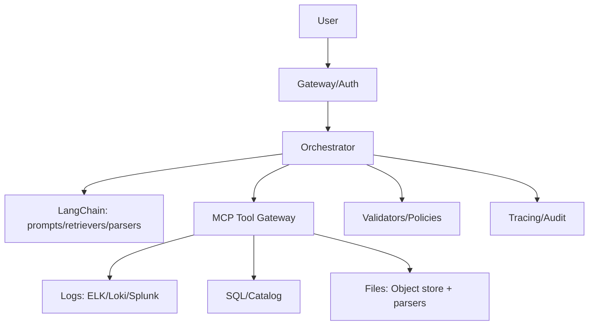

[Previous](05_00_core_components.md) | [Next](05_01_3_langraph.md)

# LangChain Deep Dive  

## Table of Contents

- [1) Where LangChain fits in the orchestrator architecture](#1-where-langchain-fits-in-the-orchestrator-architecture)
  - [1.1 Minimal component mapping](#11-minimal-component-mapping)
- [2) LangChain strengths (what it’s genuinely good at)](#2-langchain-strengths-what-its-genuinely-good-at)
  - [2.1 RAG plumbing done faster](#21-rag-plumbing-done-faster)
  - [2.2 Tool calling scaffolding](#22-tool-calling-scaffolding)
  - [2.3 Output parsing and structured responses](#23-output-parsing-and-structured-responses)
  - [2.4 Rapid iteration](#24-rapid-iteration)
- [3) LangChain weaknesses (brutal, practical)](#3-langchain-weaknesses-brutal-practical)
  - [3.1 You can accidentally build “prompt-first control”](#31-you-can-accidentally-build-prompt-first-control)
  - [3.2 Hardening is on you](#32-hardening-is-on-you)
  - [3.3 Debuggability and determinism degrade with complexity](#33-debuggability-and-determinism-degrade-with-complexity)
- [4) Recommended pattern: “Deterministic Orchestrator, LangChain as a library”](#4-recommended-pattern-deterministic-orchestrator-langchain-as-a-library)
  - [4.1 Principle](#41-principle)
  - [4.2 Practical breakdown](#42-practical-breakdown)
    - [Step A — Observe (input normalization)](#step-a-observe-input-normalization)
    - [Step B — Plan (structured plan request)](#step-b-plan-structured-plan-request)
    - [Step C — Act (tool execution)](#step-c-act-tool-execution)
    - [Step D — Verify (deterministic checks)](#step-d-verify-deterministic-checks)
    - [Step E — Refine](#step-e-refine)
- [5) Tooling architecture with LangChain + MCP (recommended)](#5-tooling-architecture-with-langchain-mcp-recommended)
  - [5.1 Why MCP matters here](#51-why-mcp-matters-here)
  - [5.2 Suggested layout](#52-suggested-layout)
- [6) RAG in LangChain: do it, but do it correctly](#6-rag-in-langchain-do-it-but-do-it-correctly)
  - [6.1 What to vectorize (good candidates)](#61-what-to-vectorize-good-candidates)
  - [6.2 What NOT to vectorize by default](#62-what-not-to-vectorize-by-default)
  - [6.3 Retrieval filters are mandatory](#63-retrieval-filters-are-mandatory)
  - [6.4 A practical “RAG node” contract](#64-a-practical-rag-node-contract)
- [7) The “chain” you actually want in production](#7-the-chain-you-actually-want-in-production)
  - [7.1 Intent → Scope → Tool selection](#71-intent-scope-tool-selection)
  - [7.2 Query drafting chains](#72-query-drafting-chains)
  - [7.3 Summarization chains](#73-summarization-chains)
- [8) Patterns that work](#8-patterns-that-work)
  - [8.1 “Tool-first” for truth, “RAG” for procedures](#81-tool-first-for-truth-rag-for-procedures)
  - [8.2 “Evidence contract” output](#82-evidence-contract-output)
  - [8.3 “Diff-first” for code agents](#83-diff-first-for-code-agents)
- [9) Patterns that fail (avoid these)](#9-patterns-that-fail-avoid-these)
- [10) Minimal LangChain usage recipe (pseudo)](#10-minimal-langchain-usage-recipe-pseudo)
- [11) When to use LangChain vs custom code](#11-when-to-use-langchain-vs-custom-code)
- [12) Checklist (production sanity)](#12-checklist-production-sanity)
- [Key takeaway](#key-takeaway)


> **Topic:** LangChain’s role inside the **Orchestrator / Agent Controller**
>
> **Positioning:** LangChain is primarily **an integration + composition layer**: prompts, tool wrappers, retrievers, loaders, output parsers, and utilities. It is *not* a governance layer, not a state machine, and not a substitute for deterministic policy enforcement.

---

## 1) Where LangChain fits in the orchestrator architecture

LangChain sits **inside** the orchestrator implementation, typically in these places:

- **Prompt construction** (templating, message assembly)
- **Tool abstraction** (define tools, schemas, execution wrappers)
- **Retrieval pipeline** (load → chunk → embed → store → retrieve)
- **Output parsing** (structured outputs, JSON schema parsing)
- **Composable chains** (small deterministic-ish pipelines)

It should **not** be relied on for:
- authorization and RBAC
- audit trails and compliance
- safety gating for destructive actions
- durable workflow state (long-running tasks)

### 1.1 Minimal component mapping

```text
UI/API Gateway
  → Orchestrator (your code)
      → LangChain utilities
          - tool wrappers
          - retrievers
          - prompt templates
          - output parsers
      → LLM provider
      → Tool gateway / MCP / internal APIs
      → Memory stores (SQL/Redis/VectorDB/Object store)
      → Observability
```

---

## 2) LangChain strengths (what it’s genuinely good at)

### 2.1 RAG plumbing done faster
- document loaders (PDF/HTML/markdown)
- chunking strategies
- embedding + vector store connectors
- retriever patterns (MMR, filters)

### 2.2 Tool calling scaffolding
- standard tool interfaces
- tool descriptions for the model
- schema-like argument patterns

### 2.3 Output parsing and structured responses
- JSON parsing helpers
- retry-on-parse patterns

### 2.4 Rapid iteration
Great for prototypes and internal assistants where the primary value is iteration speed.

---

## 3) LangChain weaknesses (brutal, practical)

### 3.1 You can accidentally build “prompt-first control”
If you rely on prompt wording for security (e.g., “don’t do harmful actions”), you will eventually get burned.

### 3.2 Hardening is on you
In production, you still need:
- strict tool allowlists
- argument validation
- budgets/timeouts
- scoped credentials
- structured auditing

### 3.3 Debuggability and determinism degrade with complexity
As chains get longer and more dynamic, reproducing behavior becomes harder unless you invest in tracing and deterministic boundaries.

---

## 4) Recommended pattern: “Deterministic Orchestrator, LangChain as a library”

### 4.1 Principle
- **Your orchestrator owns control flow** (plan/act/verify/refine).
- **LangChain provides helper components** used at specific steps.

### 4.2 Practical breakdown

#### Step A — Observe (input normalization)
- parse user input
- bind scope (tenant/env/project)
- load session context

LangChain usage:
- minimal; maybe prompt formatting utilities

#### Step B — Plan (structured plan request)
- call LLM with a strict schema
- parse output

LangChain usage:
- prompt template
- structured output parser

#### Step C — Act (tool execution)
- validate tool selection is allowed
- validate arguments
- execute tool via tool gateway/MCP

LangChain usage:
- tool wrapper objects (optional)

#### Step D — Verify (deterministic checks)
- schema validation
- business rules
- confidence gating

LangChain usage:
- none (prefer deterministic validators)

#### Step E — Refine
- replan or adjust tool calls

LangChain usage:
- prompt assembly

---

## 5) Tooling architecture with LangChain + MCP (recommended)

### 5.1 Why MCP matters here
MCP gives you a consistent “tool surface” across systems.
LangChain can call tools, but MCP is the **governed tool boundary** that scales across teams.

### 5.2 Suggested layout



Key design rule:
- LangChain helps construct requests.
- MCP + validators enforce the safe boundary.

---

## 6) RAG in LangChain: do it, but do it correctly

### 6.1 What to vectorize (good candidates)
- stable docs: runbooks, SOPs, product manuals, policy text
- curated postmortems and incident summaries
- domain FAQs

### 6.2 What NOT to vectorize by default
- raw logs (too much volume, low semantic density)
- metrics (time series)
- structured inventories (better in SQL)
- “everything” (costly and noisy)

### 6.3 Retrieval filters are mandatory
- tenant/org filter
- doc version filter
- environment filter
- time window filter for volatile docs

### 6.4 A practical “RAG node” contract
Input:
- query
- filters (tenant, product, version)

Output:
- topK passages
- citations
- confidence score

---

## 7) The “chain” you actually want in production

Most production agents benefit from **small, explicit chains**:

### 7.1 Intent → Scope → Tool selection
- router LLM (cheap)
- deterministic scope binding
- tool allowlist selection

### 7.2 Query drafting chains
Example: generate a PromQL query, then validate and execute.

### 7.3 Summarization chains
Summarize tool outputs into a consistent report format.

**Avoid:** giant monolithic “agent chain” that tries to do everything.

---

## 8) Patterns that work

### 8.1 “Tool-first” for truth, “RAG” for procedures
- tool systems of record for current facts
- RAG for instructions and known patterns

### 8.2 “Evidence contract” output
Require every claim to be backed by:
- tool output
- citation
- deterministic check

### 8.3 “Diff-first” for code agents
Never let the model rewrite entire files unless unavoidable.

---

## 9) Patterns that fail (avoid these)

- Prompt-only safety rules
- Tools that return unstructured text with no schema
- RAG used as a substitute for querying systems of record
- No budgets/timeouts on tool calls
- No audit trail

---

## 10) Minimal LangChain usage recipe (pseudo)

```python
# PSEUDO (architecture sketch)

# Orchestrator controls flow
state = bind_scope(user, env, tenant)

plan = llm_call(
  prompt=plan_template.render(tools=allowed_tools, constraints=constraints),
  output_schema=PlanSchema,
)

for step in plan.steps:
  assert tool_allowed(step.tool_name, state)
  args = validate_args(step.args, tool_schema(step.tool_name))

  result = mcp_call(step.tool_name, args, scope=state.scope)
  assert validate_result(result, expected_schema(step.tool_name))

  state = update_state(state, result)

# Only now ask LLM to narrate / summarize
final = llm_call(prompt=final_template.render(state=state))
```

LangChain can provide:
- templates
- schemas/parsers
- retrievers
- tool wrappers

But **the orchestrator remains the boss**.

---

## 11) When to use LangChain vs custom code

Use LangChain when:
- you need quick integration
- you want standardized retrievers/loaders
- you need structured output helpers

Prefer custom code when:
- you need strict policies and governance
- you need deterministic workflows
- you need long-running durable execution

(That last bullet is where **LangGraph** is a better fit.)

---

## 12) Checklist (production sanity)

- [ ] Tool allowlists enforced in code (not prompts)
- [ ] Tool inputs/outputs schema-validated
- [ ] Strong scope binding (tenant/env)
- [ ] RAG uses strict filters + versioning
- [ ] Tool budgets/timeouts/retries defined
- [ ] Tracing + audit logs exist
- [ ] Clear stop conditions and escalation path

---

## Key takeaway

LangChain is a **useful library inside the orchestrator**, mainly for RAG/tool/prompt plumbing.
It does **not** replace deterministic control, governance, or durable workflow orchestration.

[Previous](05_00_core_components.md) | [Next](05_01_3_langraph.md)
