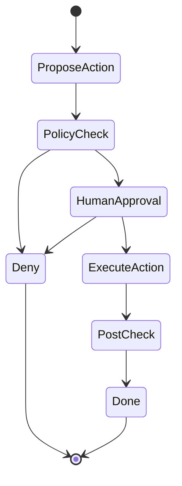
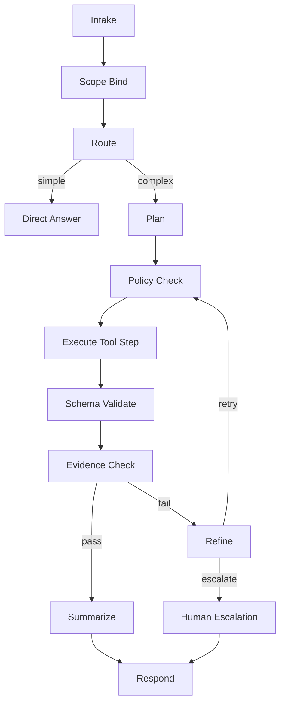

[Previous](05_01_1_langchain.md) | [Next](05_01_orchestrator_agent_controller.md)

# LangGraph Deep Dive  

## Table of Contents

- [1) Where LangGraph fits in the architecture](#1-where-langgraph-fits-in-the-architecture)
  - [1.1 What LangGraph is great at](#11-what-langgraph-is-great-at)
  - [1.2 What LangGraph is NOT](#12-what-langgraph-is-not)
- [2) Mapping LangGraph to your Orchestrator Loop](#2-mapping-langgraph-to-your-orchestrator-loop)
  - [2.1 Minimal Plan → Act → Verify → Refine graph](#21-minimal-plan-act-verify-refine-graph)
  - [2.2 Where “Respond” lives](#22-where-respond-lives)
- [3) State: the thing that makes LangGraph valuable](#3-state-the-thing-that-makes-langgraph-valuable)
  - [3.1 Suggested state schema (generic)](#31-suggested-state-schema-generic)
  - [3.2 What *must* be in state (non-negotiable)](#32-what-must-be-in-state-non-negotiable)
- [4) Deterministic guardrails in LangGraph](#4-deterministic-guardrails-in-langgraph)
  - [4.1 Guardrail nodes you should include](#41-guardrail-nodes-you-should-include)
  - [4.2 Example: action gating (human-in-loop)](#42-example-action-gating-human-in-loop)
- [5) Multi-LLM routing patterns (LangGraph-friendly)](#5-multi-llm-routing-patterns-langgraph-friendly)
  - [5.1 Why this is superior to one “mega model”](#51-why-this-is-superior-to-one-mega-model)
- [6) How LangGraph works with MCP (clean separation)](#6-how-langgraph-works-with-mcp-clean-separation)
  - [6.1 Node responsibilities](#61-node-responsibilities)
  - [6.2 Why this matters](#62-why-this-matters)
- [7) Recommended “production graph template”](#7-recommended-production-graph-template)
- [8) When LangGraph is overkill](#8-when-langgraph-is-overkill)
- [9) When LangGraph is the right choice](#9-when-langgraph-is-the-right-choice)
- [10) Common pitfalls (avoid these)](#10-common-pitfalls-avoid-these)
- [11) Minimal pseudo-implementation sketch](#11-minimal-pseudo-implementation-sketch)
- [12) Key takeaway](#12-key-takeaway)


> **Topic:** LangGraph’s role inside the **Orchestrator / Agent Controller**
>
> **Positioning:** LangGraph is an **orchestration runtime** for agent workflows — a way to implement the orchestrator as an explicit **graph/state machine** with loops, branching, approvals, retries, and durable state.
>
> **Brutal take:** If your agent needs **Plan → Act → Verify → Refine**, multi-step tool use, and safety gating, LangGraph is usually a better fit than “free-form agent loops” or ad-hoc chains.

---

## 1) Where LangGraph fits in the architecture

LangGraph lives at the same “layer” as your orchestrator — it can **be** the orchestrator implementation.

```text
UI/API Gateway
  → Orchestrator (LangGraph graph)
      → LLM calls (router/planner/executor/critic)
      → Tool Gateway (MCP / internal APIs)
      → Memory stores (SQL/Redis/VectorDB/Object store)
      → Validators/Policies
      → Observability/Audit
```

### 1.1 What LangGraph is great at
- explicit control flow (branches, loops, stop conditions)
- durable state and resumption (depending on your persistence)
- multi-agent patterns (planner/executor/critic/human-in-loop)
- deterministic guardrails around probabilistic LLM calls

### 1.2 What LangGraph is NOT
- your RBAC / auth boundary
- your audit/compliance layer
- your tool security policy (that belongs in tool gateway + orchestrator guards)

---

## 2) Mapping LangGraph to your Orchestrator Loop

Your orchestrator loop:
1) Observe
2) Plan
3) Act
4) Verify
5) Refine
6) Respond

LangGraph implements this as nodes + edges.

### 2.1 Minimal Plan → Act → Verify → Refine graph

```mermaid
flowchart TB
  I[Intake/Observe] --> R[Route Model + Tool Allowlist]
  R --> P[Planner LLM (strict JSON plan)]
  P --> A[Act: Execute tool step]
  A --> V[Verify: schema + rules + evidence check]
  V -->|pass| S[Respond/Summarize]
  V -->|fail| F[Refine: replan/repair]
  F --> A
```

### 2.2 Where “Respond” lives
Respond can be:
- a single final node (LLM finalizer)
- incremental streaming from multiple nodes (progress updates)

---

## 3) State: the thing that makes LangGraph valuable

LangGraph’s biggest win is making state explicit.

### 3.1 Suggested state schema (generic)

```json
{
  "request": {"user_msg": "...", "attachments": []},
  "scope": {"tenant": "...", "env": "...", "project": "..."},
  "intent": {"type": "ops|support|coding|medical", "confidence": 0.0},
  "plan": {"steps": [], "version": 1},
  "tool_budget": {"max_calls": 12, "used": 0, "max_cost": 2.50},
  "artifacts": {"tool_results": [], "citations": []},
  "verdict": {"status": "unknown|pass|fail", "reasons": []},
  "escalation": {"required": false, "reason": ""},
  "audit": {"trace_id": "...", "events": []}
}
```

### 3.2 What *must* be in state (non-negotiable)
- **scope** (tenant/env/patient/project) → prevents cross-boundary mistakes
- **budgets** (tool calls, time, cost) → prevents runaway loops
- **evidence** (tool outputs/citations) → prevents hallucinated claims
- **verdict** (why pass/fail) → makes behavior debuggable

---

## 4) Deterministic guardrails in LangGraph

LangGraph makes it natural to put guardrails as explicit nodes.

### 4.1 Guardrail nodes you should include
- **ScopeBind**: “what environment/tenant/patient is this?”
- **PolicyCheck**: tool allowlist + action tier
- **SchemaValidate**: verify tool inputs/outputs
- **EvidenceCheck**: every claim must reference tool output or citations
- **StopCheck**: stop conditions, loop counters, budgets

### 4.2 Example: action gating (human-in-loop)



---

## 5) Multi-LLM routing patterns (LangGraph-friendly)

LangGraph is good when you separate roles:

- **Router** (cheap): intent + complexity + tool family selection
- **Planner** (strong): structured plan output
- **Executor** (medium): tool args + interpreting outputs
- **Critic/Verifier** (optional): catches reasoning errors
- **Finalizer** (cheap): human-friendly response

### 5.1 Why this is superior to one “mega model”
- lower cost
- less latency for trivial cases
- better reliability via explicit verification

---

## 6) How LangGraph works with MCP (clean separation)

MCP is your **tool protocol**. LangGraph nodes should call MCP tools via a tool gateway.

### 6.1 Node responsibilities
- Nodes decide *what to call* and *with what arguments*
- The tool gateway enforces:
  - scope
  - auth
  - allowlists
  - rate limits
  - logging

### 6.2 Why this matters
If you let the LLM call tools “directly” without a gateway, you lose governance.

---

## 7) Recommended “production graph template”

A practical default graph for most agents:



Add optional branches for:
- RAG retrieval node (before planning or before summarization)
- Critic/verifier node (before responding)
- “Write action” path with human approval

---

## 8) When LangGraph is overkill

Don’t force it if your agent is:
- single-step retrieval + answer
- simple classification + one tool call
- no loops, no approvals, no resumption

In those cases:
- plain orchestrator code or minimal LangChain chains are sufficient.

---

## 9) When LangGraph is the right choice

Use LangGraph when you need any of:
- retries and fallbacks across tools
- branching paths based on tool output
- explicit stop conditions and budgets
- human approvals
- multi-agent roles
- resumable workflows (incident analysis, long code fixes, case review)

If the words “workflow”, “approval”, “budget”, “audit”, or “escalation” appear in your requirements, LangGraph belongs in the discussion.

---

## 10) Common pitfalls (avoid these)

- **Graph nodes that do too much** (becomes a monolith again)
- **No budgets** (runaway tool calls)
- **No scope binding** (wrong env/tenant/patient)
- **No deterministic verification** (hallucinated root causes)
- **Relying on prompts for security** (eventually fails)

---

## 11) Minimal pseudo-implementation sketch

```python
# PSEUDO: LangGraph-ish structure

State = {
  "scope": None,
  "intent": None,
  "plan": None,
  "tool_budget": {"max_calls": 12, "used": 0},
  "tool_results": [],
  "verdict": None,
}

nodes = {
  "intake": intake_node,
  "scope_bind": scope_bind_node,
  "route": route_node,
  "plan": plan_node,
  "policy_check": policy_check_node,
  "execute": execute_tool_step_node,
  "validate": validate_node,
  "evidence": evidence_node,
  "refine": refine_node,
  "respond": respond_node,
  "escalate": escalate_node,
}

edges = {
  "intake": "scope_bind",
  "scope_bind": "route",
  "route": {"simple": "respond", "complex": "plan"},
  "plan": "policy_check",
  "policy_check": "execute",
  "execute": "validate",
  "validate": "evidence",
  "evidence": {"pass": "respond", "fail": "refine"},
  "refine": {"retry": "policy_check", "escalate": "escalate"},
  "escalate": "respond",
}
```

Key point: the **edges** are the policy. The LLM doesn’t decide the control flow alone.

---

## 12) Key takeaway

LangGraph is how you implement a **real orchestrator**:
- explicit workflow
- explicit state
- explicit guardrails
- explicit stop conditions

It’s the cleanest place to encode **Plan → Verify → Refine** in a way you can audit, debug, and scale.

[Previous](05_01_1_langchain.md) | [Next](05_01_orchestrator_agent_controller.md)
