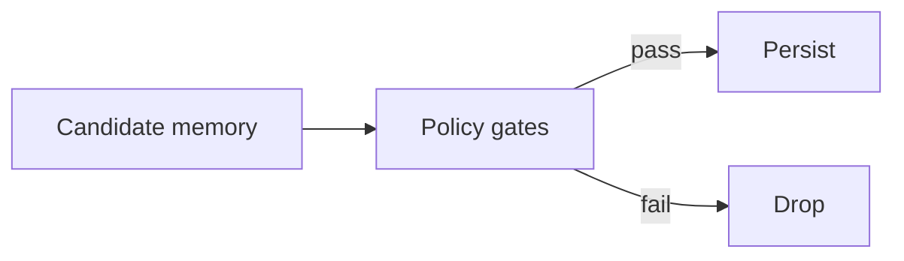

[Previous](05_04_1_context_engineering.md) | [Next](05_04_3_memory_retrieval_policy.md)

# Memory Write Policy  

## Table of Contents

- [1) Memory writes are more dangerous than memory reads](#1-memory-writes-are-more-dangerous-than-memory-reads)
- [2) Memory taxonomy (what you can store)](#2-memory-taxonomy-what-you-can-store)
  - [2.1 Working state (session state)](#21-working-state-session-state)
  - [2.2 Long-term memory (user/system)](#22-long-term-memory-usersystem)
  - [2.3 Knowledge memory (RAG corpora)](#23-knowledge-memory-rag-corpora)
- [3) The core rule: only store what is (a) stable, (b) useful, (c) safe](#3-the-core-rule-only-store-what-is-a-stable-b-useful-c-safe)
  - [3.1 Store these (good candidates)](#31-store-these-good-candidates)
  - [3.2 Do NOT store these by default](#32-do-not-store-these-by-default)
- [4) Memory write gates (the “no regrets” policy)](#4-memory-write-gates-the-no-regrets-policy)
  - [4.1 Gate 1 — Scope gate (mandatory)](#41-gate-1-scope-gate-mandatory)
  - [4.2 Gate 2 — Source gate](#42-gate-2-source-gate)
  - [4.3 Gate 3 — Stability gate](#43-gate-3-stability-gate)
  - [4.4 Gate 4 — Safety gate](#44-gate-4-safety-gate)
  - [4.5 Gate 5 — Utility gate](#45-gate-5-utility-gate)
- [5) Memory item schema (store structured, not blobs)](#5-memory-item-schema-store-structured-not-blobs)
  - [5.1 Recommended schema](#51-recommended-schema)
  - [5.2 Why structured matters](#52-why-structured-matters)
- [6) TTL policy (expiration is your friend)](#6-ttl-policy-expiration-is-your-friend)
  - [6.1 Default TTL recommendations](#61-default-ttl-recommendations)
  - [6.2 A simple TTL table](#62-a-simple-ttl-table)
- [7) Preventing memory poisoning (hallucination control)](#7-preventing-memory-poisoning-hallucination-control)
  - [7.1 The “write only after verify” rule](#71-the-write-only-after-verify-rule)
  - [7.2 Confidence requirement](#72-confidence-requirement)
  - [7.3 Two-phase commit for memory](#73-two-phase-commit-for-memory)
- [8) Memory write triggers (when to store)](#8-memory-write-triggers-when-to-store)
  - [8.1 Good triggers](#81-good-triggers)
  - [8.2 Bad triggers](#82-bad-triggers)
- [9) What to store where (storage mapping)](#9-what-to-store-where-storage-mapping)
  - [9.1 Store preferences/decisions in SQL/KV](#91-store-preferencesdecisions-in-sqlkv)
  - [9.2 Store summaries in SQL + optionally vectorize](#92-store-summaries-in-sql-optionally-vectorize)
  - [9.3 Store artifacts in object storage, store references in memory](#93-store-artifacts-in-object-storage-store-references-in-memory)
  - [9.4 Don’t use vector DB as your only memory store](#94-dont-use-vector-db-as-your-only-memory-store)
- [10) Domain-specific write rules (your use cases)](#10-domain-specific-write-rules-your-use-cases)
  - [10.1 Customer support agent](#101-customer-support-agent)
  - [10.2 Travel agent](#102-travel-agent)
  - [10.3 Electronics design agent](#103-electronics-design-agent)
  - [10.4 Coding agent](#104-coding-agent)
  - [10.5 Medical agent](#105-medical-agent)
  - [10.6 Ops troubleshooting agent](#106-ops-troubleshooting-agent)
- [11) Update + revoke semantics (memory must be editable)](#11-update-revoke-semantics-memory-must-be-editable)
  - [11.1 Preferences are mutable](#111-preferences-are-mutable)
  - [11.2 Decisions/constraints are versioned](#112-decisionsconstraints-are-versioned)
  - [11.3 Facts decay](#113-facts-decay)
- [12) Privacy, redaction, and compliance](#12-privacy-redaction-and-compliance)
  - [12.1 Sensitivity classification](#121-sensitivity-classification)
  - [12.2 Redaction rules](#122-redaction-rules)
  - [12.3 Data minimization](#123-data-minimization)
- [13) Failure modes (how you know writes are broken)](#13-failure-modes-how-you-know-writes-are-broken)
- [14) Minimal checklist](#14-minimal-checklist)
- [Key takeaway](#key-takeaway)


> **Topic:** Memory Write Policy (What to Store, When to Store, and How to Avoid Poisoning)
>
> **What this is:** A **deterministic policy** that decides what information an agent is allowed to persist outside the current context window.
>
> **Brutal truth:** Most “memory” systems fail because they:
> - store too much junk
> - store hallucinations as facts
> - store sensitive data without intent/consent
> - mix tenants/users/sessions
> - make memory retrieval noisy and untrustworthy

---

## 1) Memory writes are more dangerous than memory reads

**Reads** can be filtered, ranked, and ignored.
**Writes** permanently change what the agent will believe next time.

If you get writes wrong, your agent becomes confidently wrong at scale.

---

## 2) Memory taxonomy (what you can store)

### 2.1 Working state (session state)
- short-term only
- tied to one workflow
- expires quickly

### 2.2 Long-term memory (user/system)
- preferences
- stable profile info
- durable summaries of completed tasks

### 2.3 Knowledge memory (RAG corpora)
- curated documents (runbooks, policies, manuals)
- typically managed by a doc pipeline, not conversational writes

**This doc is primarily about 2.2** (long-term memory) and selective durable artifacts.

---

## 3) The core rule: only store what is (a) stable, (b) useful, (c) safe

### 3.1 Store these (good candidates)
1) **User preferences** (explicit, stable)
   - language
   - timezone
   - preferred output format
   - default region/environment

2) **Approved decisions / constraints**
   - “read-only mode”
   - “don’t make purchases without confirmation”
   - “use ap-mumbai-1 by default”

3) **Validated facts** with source
   - “ticket 123 resolved by rollback at 02:31” (source: tool)
   - “cluster name = prod-oke-1” (source: tool)

4) **Durable task outcomes**
   - final answer summaries
   - generated artifacts (docs, code, diagrams)

### 3.2 Do NOT store these by default
- raw logs (high volume, low long-term value)
- raw tool outputs / JSON blobs
- model speculation (“I think root cause is…”) unless verified
- transient data (prices, live status, ephemeral metrics)
- sensitive personal data unless absolutely required and permitted

---

## 4) Memory write gates (the “no regrets” policy)

A memory write should happen only if it passes gates.

### 4.1 Gate 1 — Scope gate (mandatory)
Every memory item must be bound to scope:
- user_id / tenant_id
- environment/project
- domain (support/travel/ops/medical)

If scope is missing → **no write**.

### 4.2 Gate 2 — Source gate
A memory item must have a **source of truth**:
- `user_explicit`
- `tool_output`
- `approved_doc`

If source is `model_guess` → **no write**.

### 4.3 Gate 3 — Stability gate
Ask: “Will this be true next week?”
If likely to change soon → store with TTL or don’t store.

### 4.4 Gate 4 — Safety gate
- PII/PHI/secret detection
- compliance policy check
- redaction

If sensitive and not essential → **no write**.

### 4.5 Gate 5 — Utility gate
Ask: “Will storing this reduce future work?”
If not clearly useful → **no write**.

---

## 5) Memory item schema (store structured, not blobs)

### 5.1 Recommended schema

```json
{
  "memory_id": "uuid",
  "type": "preference|fact|decision|summary|artifact_ref",
  "scope": {
    "tenant": "acme",
    "user": "u_123",
    "domain": "ops",
    "env": "prod",
    "project": "payments"
  },
  "key": "default_region",
  "value": "ap-mumbai-1",
  "source": {
    "kind": "user_explicit|tool_output|approved_doc",
    "ref": "tool:oci.identity#call_42",
    "ts": "2025-12-13T12:15:00+05:30"
  },
  "confidence": 0.95,
  "ttl": "P365D",
  "tags": ["routing", "region"],
  "sensitivity": "none|low|pii|phi|secret",
  "redacted": true,
  "created_at": "...",
  "updated_at": "..."
}
```

### 5.2 Why structured matters
- filtering is easy
- retrieval is precise
- dedupe is possible
- audit is possible

---

## 6) TTL policy (expiration is your friend)

### 6.1 Default TTL recommendations
- preferences: long (months/years)
- decisions/constraints: long (until revoked)
- validated facts: medium (weeks/months)
- summaries: medium/long (depends)
- volatile facts: short (hours/days)

### 6.2 A simple TTL table

| Memory Type | TTL default | Notes |
|---|---:|---|
| Preference | 365d+ | until user changes |
| Decision/constraint | none | versioned + revocable |
| Fact (validated) | 30–180d | depends on domain |
| Incident summary | 180–365d | highly useful |
| Volatile status | 1–7d | better queried live |

---

## 7) Preventing memory poisoning (hallucination control)

### 7.1 The “write only after verify” rule
Only write facts after:
- schema validation
- cross-check with tool
- user confirmation (if it came from user)

### 7.2 Confidence requirement
Require minimum confidence per type:
- preference: 0.9 (must be explicit)
- fact from tools: 0.8
- summary: 0.7 (but label as summary)

### 7.3 Two-phase commit for memory
1) propose memory writes
2) run validator
3) persist if approved



---

## 8) Memory write triggers (when to store)

### 8.1 Good triggers
- user explicitly says: “Remember that…” / “From now on…”
- end of workflow: store final outcome summary
- approval events: store decisions
- post-incident: store runbook learnings (curated)

### 8.2 Bad triggers
- every user message
- every tool output
- every partial hypothesis

---

## 9) What to store where (storage mapping)

### 9.1 Store preferences/decisions in SQL/KV
Why:
- deterministic reads
- easy filtering by scope
- easy updates/revokes

### 9.2 Store summaries in SQL + optionally vectorize
- SQL for reliable retrieval
- vector index for semantic lookup across summaries

### 9.3 Store artifacts in object storage, store references in memory
Example:
- PDF/doc saved in object store
- memory stores: pointer + metadata

### 9.4 Don’t use vector DB as your only memory store
Vector DB is for semantic search, not authoritative storage.

---

## 10) Domain-specific write rules (your use cases)

### 10.1 Customer support agent
Store:
- preferred channel, language
- customer-level constraints (“always ask before refund”)
- ticket resolution summaries (validated)

Don’t store:
- raw chat transcripts (unless required)
- payment card details, addresses, etc.

### 10.2 Travel agent
Store:
- seat/baggage preferences
- passport/visa constraints (if user explicitly wants)
- travel style (budget vs comfort)

Don’t store:
- live prices as facts
- sensitive identity documents unless necessary and allowed

### 10.3 Electronics design agent
Store:
- design constraints templates
- preferred vendors/part families
- validated design decisions

Don’t store:
- unverified “this part is valid” claims

### 10.4 Coding agent
Store:
- formatting preferences
- repo conventions (linting rules)
- recurring constraints (“no refactor unless asked”)

Don’t store:
- secrets from .env
- raw proprietary code in long-term memory unless explicitly required

### 10.5 Medical agent
Store:
- only with strict consent and policy
- de-identified summaries if possible

Default stance: **don’t store patient-level details** beyond the active session unless the system is explicitly designed for it.

### 10.6 Ops troubleshooting agent
Store:
- incident summaries (what happened, fix, references)
- known-good runbook pointers
- stable service ownership metadata

Don’t store:
- raw logs
- speculative root causes

---

## 11) Update + revoke semantics (memory must be editable)

### 11.1 Preferences are mutable
- last write wins
- keep change history

### 11.2 Decisions/constraints are versioned
- require explicit revocation
- keep audit trail

### 11.3 Facts decay
- TTL expiry
- periodic re-validation (optional)

---

## 12) Privacy, redaction, and compliance

### 12.1 Sensitivity classification
- none
- low
- pii
- phi
- secret

### 12.2 Redaction rules
- redact at write time
- store minimal tokens
- store hashes/pointers instead of raw values

### 12.3 Data minimization
Store the smallest representation that is useful.

---

## 13) Failure modes (how you know writes are broken)

- agent “remembers” wrong facts
- user says “I never told you that”
- cross-tenant bleed
- memory retrieval is noisy and irrelevant
- storage costs climb

---

## 14) Minimal checklist

- [ ] Scope is mandatory for every memory write
- [ ] Source must not be model speculation
- [ ] TTL is set for non-preference items
- [ ] Sensitive data is blocked or redacted
- [ ] Memory items are structured (not blobs)
- [ ] Writes pass deterministic gates
- [ ] Preferences are editable/revocable

---

## Key takeaway

**Memory writing is governance.**
Store only stable, useful, safe, and source-backed information.
Everything else should be fetched live via tools or retrieved via curated RAG.

[Previous](05_04_1_context_engineering.md) | [Next](05_04_3_memory_retrieval_policy.md)
