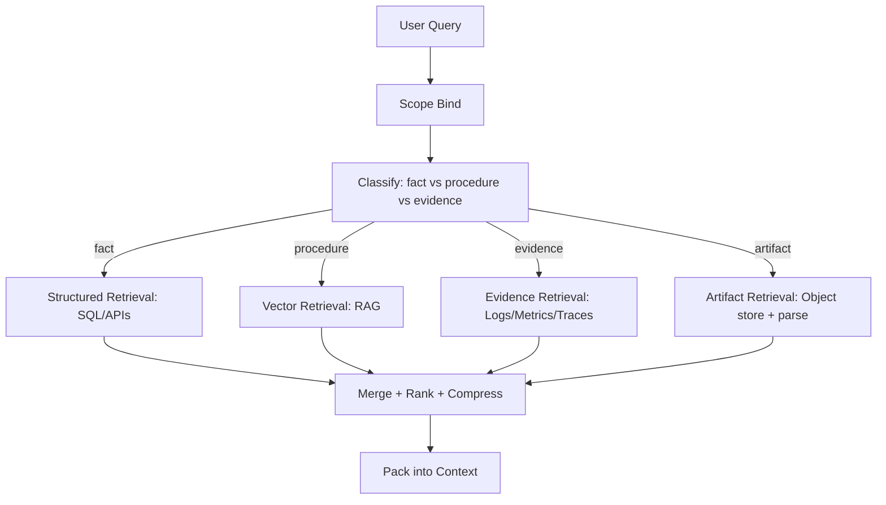

[Previous](05_04_2_memory_write_policy.md) | [Next](05_05_policies_and_guardrails.md)

# Memory Retrieval Policy  

## Table of Contents

- [1) Retrieval is a decision problem](#1-retrieval-is-a-decision-problem)
- [2) The systems-of-record rule (authoritative data wins)](#2-the-systems-of-record-rule-authoritative-data-wins)
  - [2.1 Choose a system of record first](#21-choose-a-system-of-record-first)
- [3) Retrieval routing (how the agent knows where to look)](#3-retrieval-routing-how-the-agent-knows-where-to-look)
  - [3.1 A practical routing pipeline](#31-a-practical-routing-pipeline)
  - [3.2 Classification labels that actually help](#32-classification-labels-that-actually-help)
- [4) Scope filters (mandatory, everywhere)](#4-scope-filters-mandatory-everywhere)
  - [4.1 Scope is not optional](#41-scope-is-not-optional)
  - [4.2 “Fail closed” behavior](#42-fail-closed-behavior)
- [5) Retrieval by store type](#5-retrieval-by-store-type)
- [5.1 SQL / Structured stores (catalogs, tickets, inventory)](#51-sql-structured-stores-catalogs-tickets-inventory)
  - [What to use it for](#what-to-use-it-for)
  - [Query style](#query-style)
  - [Output to context](#output-to-context)
- [5.2 Logs/metrics/traces platforms (ELK/Loki/Splunk/Prom/APM)](#52-logsmetricstraces-platforms-elklokisplunkpromapm)
  - [What to use it for](#what-to-use-it-for)
  - [Query style](#query-style)
  - [Output to context](#output-to-context)
- [5.3 Vector DB (RAG)](#53-vector-db-rag)
  - [What to use it for](#what-to-use-it-for)
  - [Retrieval rules](#retrieval-rules)
  - [Output to context](#output-to-context)
- [5.4 Object storage (PDFs, images, DICOM, manuals)](#54-object-storage-pdfs-images-dicom-manuals)
  - [What to use it for](#what-to-use-it-for)
  - [Retrieval rules](#retrieval-rules)
  - [Output to context](#output-to-context)
- [6) Retrieval ranking and merging](#6-retrieval-ranking-and-merging)
  - [6.1 Merge policy (recommended)](#61-merge-policy-recommended)
  - [6.2 De-duplication](#62-de-duplication)
  - [6.3 Compression](#63-compression)
- [7) Retrieval budgets (token + cost budgets)](#7-retrieval-budgets-token-cost-budgets)
  - [7.1 Token budget per retrieval type](#71-token-budget-per-retrieval-type)
  - [7.2 Cost budget](#72-cost-budget)
- [8) Safety: prompt injection and untrusted evidence](#8-safety-prompt-injection-and-untrusted-evidence)
  - [8.1 Untrusted content rule](#81-untrusted-content-rule)
  - [8.2 Evidence wrappers](#82-evidence-wrappers)
  - [8.3 Tool allowlists are the real defense](#83-tool-allowlists-are-the-real-defense)
- [9) Memory retrieval vs RAG retrieval (not the same)](#9-memory-retrieval-vs-rag-retrieval-not-the-same)
  - [9.1 Memory retrieval](#91-memory-retrieval)
  - [9.2 RAG retrieval](#92-rag-retrieval)
- [10) A realistic retrieval decision table (thumb rule)](#10-a-realistic-retrieval-decision-table-thumb-rule)
- [11) Domain-specific retrieval recipes (your 6 agents)](#11-domain-specific-retrieval-recipes-your-6-agents)
  - [11.1 Customer support agent](#111-customer-support-agent)
  - [11.2 Travel agent](#112-travel-agent)
  - [11.3 Electronics design agent](#113-electronics-design-agent)
  - [11.4 Coding agent](#114-coding-agent)
  - [11.5 Medical agent](#115-medical-agent)
  - [11.6 Ops troubleshooting agent](#116-ops-troubleshooting-agent)
- [12) Implementation pattern: RetrievalPlan object](#12-implementation-pattern-retrievalplan-object)
- [13) Failure modes (how you know retrieval is broken)](#13-failure-modes-how-you-know-retrieval-is-broken)
- [14) Minimal checklist](#14-minimal-checklist)
- [Key takeaway](#key-takeaway)


> **Topic:** Memory Retrieval Policy (How the agent decides what to fetch, from where, and how to keep it precise)
>
> **What this is:** The deterministic strategy for:
> - selecting the right store (SQL vs Vector vs Object store vs Logs)
> - applying scope filters
> - retrieving candidates
> - ranking + de-duping
> - compressing into context budgets
>
> **Brutal truth:** Retrieval quality is where most “RAG agents” die. Bad retrieval looks like hallucination even when the model is fine.

---

## 1) Retrieval is a decision problem

Given a user question, the agent must decide:
1) **Which system(s) are authoritative** for this question?
2) Should it fetch **structured truth**, **unstructured procedures**, or **both**?
3) How to bind **scope** (tenant/env/user/patient/time window)?
4) How to avoid bringing irrelevant or unsafe content into the prompt?

---

## 2) The systems-of-record rule (authoritative data wins)

### 2.1 Choose a system of record first
- **Live facts** (status, orders, inventory, configs) → tools / DB
- **Procedures/policies** (how-to, rules) → RAG (vector)
- **Raw evidence streams** (logs/metrics/traces) → ELK/Loki/Prom/APM
- **Artifacts** (PDFs, DICOM, manuals) → object store + parsers

**Brutal rule:** Do not answer factual questions from vector search if a system of record exists.

---

## 3) Retrieval routing (how the agent knows where to look)

### 3.1 A practical routing pipeline



### 3.2 Classification labels that actually help
- **fact_lookup**: needs systems-of-record
- **procedure_lookup**: needs docs/runbooks
- **evidence_triage**: needs logs/metrics/traces
- **artifact_analysis**: needs file fetch + parse

Do not over-classify. Keep it small and actionable.

---

## 4) Scope filters (mandatory, everywhere)

### 4.1 Scope is not optional
Every retrieval must use scope constraints:
- tenant/org
- user/patient
- environment (prod/uat)
- service/component
- region/cluster
- time window

### 4.2 “Fail closed” behavior
If scope is missing or ambiguous:
- ask a clarifying question
- or default to **read-only** + minimal safe retrieval

Never “guess prod”.

---

## 5) Retrieval by store type

## 5.1 SQL / Structured stores (catalogs, tickets, inventory)

### What to use it for
- part catalogs (electronics)
- bookings/orders
- ticket metadata
- configuration state
- user profile (preferences)

### Query style
- filters first (tenant/env)
- key-based lookups
- join across known entities

### Output to context
- extract only relevant columns
- summarize counts + top results
- include IDs for later drill-down

**Avoid:** dumping whole rows/tables.

---

## 5.2 Logs/metrics/traces platforms (ELK/Loki/Splunk/Prom/APM)

### What to use it for
- “what happened when”
- error signatures
- correlation across time
- evidence for diagnosis

### Query style
- strict time bounding
- service/node filters
- limit results (top N)

### Output to context
- 3–10 representative lines
- aggregated stats (error rate, p95)
- trace IDs
- deploy/change events aligned to timeline

**Brutal rule:** never feed the model raw unbounded logs.

---

## 5.3 Vector DB (RAG)

### What to use it for
- stable docs: policies, runbooks, manuals
- incident playbooks
- curated postmortems
- spec sheet excerpts (not the entire datasheet)

### Retrieval rules
- apply metadata filters first
- use hybrid retrieval (keyword + semantic) when possible
- rerank results
- de-duplicate

### Output to context
- top-K passages with citations
- doc version/date
- keep passages short and dense

**Avoid:** retrieving old versions without version filters.

---

## 5.4 Object storage (PDFs, images, DICOM, manuals)

### What to use it for
- PDFs and scans
- product manuals
- medical images
- large vendor documentation

### Retrieval rules
- fetch by ID/path (not semantic search)
- parse into extractable text/structures
- for images: use a vision model or specialized extractor

### Output to context
- extracted structured fields
- key pages/sections
- citations (page numbers)

**Avoid:** stuffing entire PDF text into the prompt.

---

## 6) Retrieval ranking and merging

If multiple retrieval streams exist, you need deterministic merging.

### 6.1 Merge policy (recommended)
1) structured truth (SQL/API)
2) evidence streams (logs/metrics)
3) procedural docs (RAG)
4) artifacts (PDF extracts)

Why:
- facts + evidence should anchor decisions
- docs should guide “what to do next”

### 6.2 De-duplication
- remove near-duplicate RAG passages
- collapse repeated log signatures
- keep the best representative examples

### 6.3 Compression
Apply per-source compression before packing.

---

## 7) Retrieval budgets (token + cost budgets)

### 7.1 Token budget per retrieval type
Example for a diagnosis step:
- SQL outputs: 500–1000 tokens
- logs/metrics: 800–1500 tokens
- RAG passages: 600–1200 tokens
- PDF extracts: 300–800 tokens

### 7.2 Cost budget
- cap embedding/query costs
- cap tool calls
- stop after N attempts

**Brutal rule:** Unlimited retrieval = unpredictable bills.

---

## 8) Safety: prompt injection and untrusted evidence

### 8.1 Untrusted content rule
Everything retrieved (docs, logs, PDFs) is **data**, not instructions.

### 8.2 Evidence wrappers
Wrap retrieved content in tagged blocks:

```text
[EVIDENCE][source=loki][untrusted]
...
[/EVIDENCE]
```

### 8.3 Tool allowlists are the real defense
Even if retrieved text says “run this destructive command”, your orchestrator must deny it.

---

## 9) Memory retrieval vs RAG retrieval (not the same)

### 9.1 Memory retrieval
- user-specific
- scoped per user/tenant
- preferences + prior decisions + summaries

### 9.2 RAG retrieval
- org knowledge base
- scoped by tenant/product/version
- policies/runbooks/manuals

Keep them separate.

---

## 10) A realistic retrieval decision table (thumb rule)

| Query type | Best source | Vectorize? | Why |
|---|---|---:|---|
| “Is this capacitor valid for 105°C?” | SQL catalog + datasheet excerpt | Partly | truth from catalog; excerpt for nuance |
| “Design PSU for 12V 8A” | calculators + rules + parts DB | Yes (rules) | computation + curated design notes |
| “What errors happened on node X yesterday?” | logs/metrics tools | No | logs are time-indexed evidence |
| “What’s the refund policy?” | RAG | Yes | stable text |
| “What did we decide last time?” | memory store | Maybe | decisions ledger |

---

## 11) Domain-specific retrieval recipes (your 6 agents)

### 11.1 Customer support agent
- facts: CRM/order DB
- procedure: refund/returns policy in RAG
- memory: user preferences + prior resolutions

### 11.2 Travel agent
- facts: inventory tools + booking DB
- procedure: airline cancellation rules (RAG)
- memory: constraints ledger (budget, visa, baggage)

### 11.3 Electronics design agent
- facts: parts catalog (SQL)
- procedure: design guides + app notes (RAG)
- artifacts: datasheet PDFs (fetch + parse top sections)
- compute: tool-based calculations

### 11.4 Coding agent
- facts: repo state (git)
- procedure: internal conventions (RAG)
- evidence: test failures/logs

### 11.5 Medical agent
- facts: structured findings + patient context
- artifacts: DICOM/X-ray with vision extraction
- procedure: guideline citations (RAG)

### 11.6 Ops troubleshooting agent
- facts: service catalog + deploy history
- evidence: logs/metrics/traces
- procedure: runbooks (RAG)
- memory: incident summaries

---

## 12) Implementation pattern: RetrievalPlan object

Make retrieval explicit. Output a structured plan:

```json
{
  "scope": {"tenant": "acme", "env": "prod", "service": "payments"},
  "time_window": {"from": "...", "to": "..."},
  "intents": ["evidence_triage", "procedure_lookup"],
  "retrieval": [
    {"type": "logs", "tool": "loki.query", "limit": 200, "summary": true},
    {"type": "metrics", "tool": "prom.query", "queries": ["..."], "summary": true},
    {"type": "rag", "index": "runbooks", "filters": {"service": "payments"}, "k": 6}
  ],
  "budgets": {"tool_calls": 8, "tokens": 7000}
}
```

This makes retrieval reproducible and debuggable.

---

## 13) Failure modes (how you know retrieval is broken)

- irrelevant docs retrieved repeatedly
- wrong version of policy/runbook
- cross-tenant leaks
- the model asks for info already retrieved
- high token usage from log dumps
- “generic answers” despite evidence existing

---

## 14) Minimal checklist

- [ ] Scope filters applied to every retrieval
- [ ] System-of-record preferred for facts
- [ ] RAG used for procedures, not live truth
- [ ] Logs/metrics bounded by time + limits
- [ ] De-dup + compress before packing
- [ ] RetrievalPlan logged per run
- [ ] Budgets enforced (token + tool + cost)

---

## Key takeaway

Retrieval is an orchestration discipline:
- pick the authoritative store first
- filter by scope
- retrieve narrowly
- compress aggressively
- pack by priority

Do this well and your agent feels smart.
Do it poorly and you’ll blame the model for your retrieval mistakes.

[Previous](05_04_2_memory_write_policy.md) | [Next](05_05_policies_and_guardrails.md)
