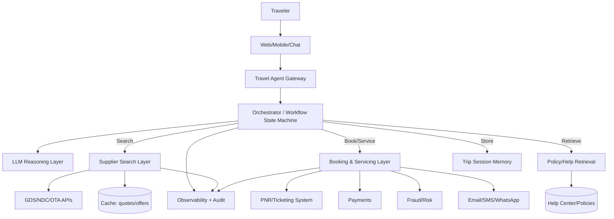
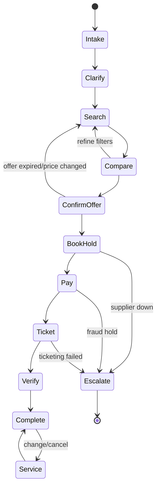
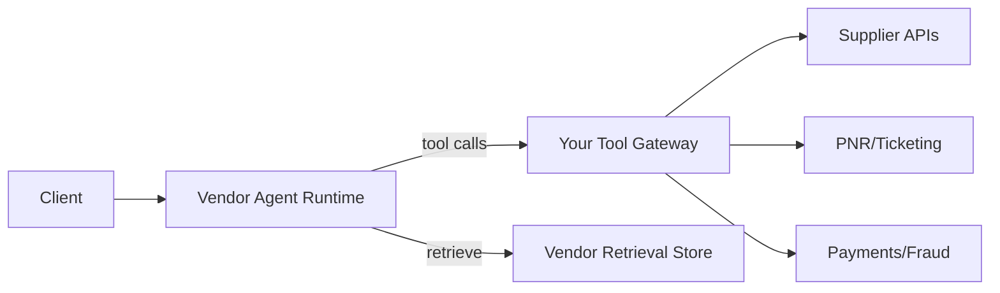
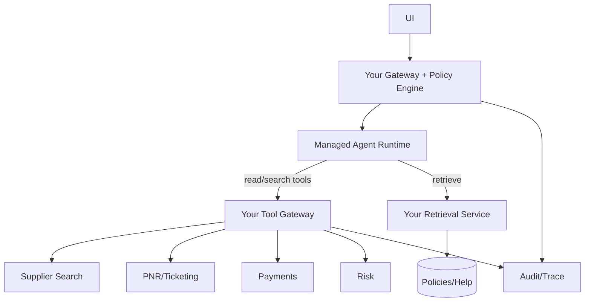
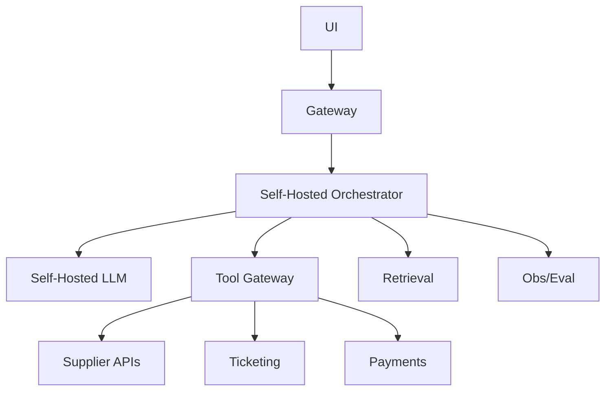

[Previous](12_01_customer_support_agent_architecture.md) | [Next](12_03_electronics_design_agent_architecture.md)

# Travel Agent Architecture  

## Table of Contents

- [0. What the travel agent must *actually* do (scope)](#0-what-the-travel-agent-must-actually-do-scope)
  - [Explicit non‑goals (unless you accept legal + financial risk)](#explicit-nongoals-unless-you-accept-legal-financial-risk)
- [1. Data sources and the right storage/retrieval approach](#1-data-sources-and-the-right-storageretrieval-approach)
  - [1.1 Structured systems (query, don’t embed)](#11-structured-systems-query-dont-embed)
  - [1.2 Semi‑structured](#12-semistructured)
  - [1.3 Unstructured (RAG can help)](#13-unstructured-rag-can-help)
  - [1.4 User preferences (memory, carefully)](#14-user-preferences-memory-carefully)
- [2. Operating model: the travel agent control loop](#2-operating-model-the-travel-agent-control-loop)
- [3. Reference architecture (common across all deployment modes)](#3-reference-architecture-common-across-all-deployment-modes)
  - [3.1 High‑level block diagram](#31-highlevel-block-diagram)
  - [3.2 Component responsibilities](#32-component-responsibilities)
- [4. The hardest truth: booking is a financial transaction](#4-the-hardest-truth-booking-is-a-financial-transaction)
  - [4.1 Non‑negotiable engineering properties](#41-nonnegotiable-engineering-properties)
- [5. Tool contracts (what the agent must call)](#5-tool-contracts-what-the-agent-must-call)
  - [5.1 Search tools (read‑only)](#51-search-tools-readonly)
  - [5.2 Booking tools (write, gated)](#52-booking-tools-write-gated)
  - [5.3 Post‑booking servicing (write, gated)](#53-postbooking-servicing-write-gated)
  - [5.4 Structured errors (mandatory)](#54-structured-errors-mandatory)
- [6. Freshness, caching, and quote validity (the travel‑specific core)](#6-freshness-caching-and-quote-validity-the-travelspecific-core)
  - [6.1 What to cache](#61-what-to-cache)
  - [6.2 What NOT to cache](#62-what-not-to-cache)
  - [6.3 A practical rule](#63-a-practical-rule)
- [7. The orchestrator state machine (how to avoid chaos)](#7-the-orchestrator-state-machine-how-to-avoid-chaos)
  - [7.1 State diagram](#71-state-diagram)
  - [7.2 Confirmation gates](#72-confirmation-gates)
- [8. Policy retrieval vs fare rules (don’t mix them)](#8-policy-retrieval-vs-fare-rules-dont-mix-them)
  - [8.1 What RAG is good for](#81-what-rag-is-good-for)
  - [8.2 What RAG must NOT override](#82-what-rag-must-not-override)
- [9. Three deployment options (what to choose and why)](#9-three-deployment-options-what-to-choose-and-why)
  - [9.1 Option A — Agent‑as‑a‑Service (managed)](#91-option-a-agentasaservice-managed)
  - [9.2 Option B — Hybrid (recommended)](#92-option-b-hybrid-recommended)
  - [9.3 Option C — In‑house (only when forced)](#93-option-c-inhouse-only-when-forced)
- [10. Autonomy model (what to allow)](#10-autonomy-model-what-to-allow)
  - [10.1 Recommended tiers](#101-recommended-tiers)
- [11. Observability and audit (chargebacks and disputes demand it)](#11-observability-and-audit-chargebacks-and-disputes-demand-it)
  - [11.1 Recommended metrics](#111-recommended-metrics)
- [12. Evaluation (how you keep it sane)](#12-evaluation-how-you-keep-it-sane)
  - [12.1 Golden journeys](#121-golden-journeys)
  - [12.2 What to measure](#122-what-to-measure)
- [13. Common failure modes (what will break)](#13-common-failure-modes-what-will-break)
- [14. Recommended approach (summary)](#14-recommended-approach-summary)
- [Appendix A — Implementation checklist (minimum)](#appendix-a-implementation-checklist-minimum)
- [Appendix B — Suggested MCP packaging (optional)](#appendix-b-suggested-mcp-packaging-optional)


> **Use case #2:** Travel Agent (planning → search → booking → changes/cancellation → support)
>
> **Goal:** A production architecture blueprint with 3 deployment options (**Agent‑as‑a‑Service**, **Hybrid**, **In‑house**) and a recommended approach for most orgs.
>
> **Design stance:** Travel agents fail in production due to **stale inventory**, **fare‑rule complexity**, and **unsafe write actions**. The model is rarely the bottleneck; **tooling, confirmation gates, and idempotency** are.

---

## 0. What the travel agent must *actually* do (scope)

A useful travel agent should reliably handle:

- **Trip intent capture**: cities, dates, flexibility, budget, passengers, preferences
- **Option search**: flights/hotels/trains, fare families, baggage, cabin classes
- **Comparison**: tradeoffs (price vs duration vs stops vs airline) with clear constraints
- **Booking** (high‑risk write): PNR creation, payment, ticketing, confirmations
- **Post‑booking servicing**: changes, cancellation, refunds, reissues, ancillaries
- **Policy interpretation**: fare rules + airline constraints + platform policies
- **Escalation**: to human for exceptions, high value, chargebacks, fraud risk

### Explicit non‑goals (unless you accept legal + financial risk)
- Autonomous booking without explicit user confirmation
- Guessing refunds or fare penalties without reading authoritative fare rules
- Storing sensitive data (card PAN, medical/special category data) in agent memory

---

## 1. Data sources and the right storage/retrieval approach

Travel is a mixed‑data problem.

### 1.1 Structured systems (query, don’t embed)
- Inventory/search APIs (GDS/NDC/OTA supplier)
- Pricing + availability
- Booking/PNR/ticketing systems
- Payments + fraud signals
- Customer profile + loyalty
- Refunds and chargebacks

**Retrieval style:** deterministic API calls with strict parameters and timeouts.

### 1.2 Semi‑structured
- Airline fare rules / penalties returned as text blobs
- Booking notes and servicing events

**Retrieval style:** metadata filter + lexical search + selective embeddings for explanation.

### 1.3 Unstructured (RAG can help)
- Help center articles
- platform policies
- airline change/cancel FAQs
- country‑specific regulatory notes

**Retrieval style:** hybrid retrieval with versioning and locality/market filters.

### 1.4 User preferences (memory, carefully)
- preferred airlines, seat, baggage tolerance, max stops

**Storage rule:** store only durable preferences; never store payment secrets.

---

## 2. Operating model: the travel agent control loop

Travel is a **multi‑phase** workflow. Treat it like a state machine:

1) **Clarify** requirements
2) **Search** and gather options
3) **Constrain** (filters + preferences)
4) **Explain** tradeoffs (top‑k)
5) **Confirm** a specific itinerary/offer
6) **Book** (PNR + payment + ticketing)
7) **Verify** ticketed/confirmed state
8) **Service** (changes/cancel)

Key constraint: the agent must be **freshness‑aware**.
- Search results expire quickly.
- Prices change.
- Seats disappear.

---

## 3. Reference architecture (common across all deployment modes)

### 3.1 High‑level block diagram



### 3.2 Component responsibilities

- **Gateway**: auth, PII handling, quotas, localization (currency/market), request shaping
- **Orchestrator**: deterministic workflow control, budgets, timeouts, confirmation gates
- **Supplier search layer**: multi‑supplier fan‑out, normalization, caching, quote validity tracking
- **Booking/servicing layer**: idempotent operations, payment orchestration, ticket verification
- **RAG/policy**: explain rules and platform policies; never override live fare rules
- **Memory**: trip state + user constraints; short‑lived for prices/offers
- **Observability**: trace every offer selection and booking attempt; audit for disputes

---

## 4. The hardest truth: booking is a financial transaction

A travel agent that can book is closer to a payments system than a chatbot.

### 4.1 Non‑negotiable engineering properties
- **Idempotency keys** for every booking/payment call
- **Offer validity** checks (expiry timestamps)
- **Two‑phase commit** style flow (hold/price → pay → ticket)
- **Post‑condition verification** (ticketed? PNR exists? email sent?)
- **Clear user confirmation** before any irreversible action

---

## 5. Tool contracts (what the agent must call)

### 5.1 Search tools (read‑only)
Minimum surface:
- `geo.resolve_city(name) -> city_code`
- `search.flights(params) -> offers[] (with expiry)`
- `search.hotels(params) -> offers[] (with expiry)`
- `search.fares_rules(offer_id) -> rules_blob`
- `search.baggage(offer_id) -> baggage_info`

**Offer object should include:**
- unique offer_id
- price breakdown
- fare family
- baggage
- constraints
- expiry timestamp

### 5.2 Booking tools (write, gated)
- `book.create_pnr(offer_id, pax_details) -> pnr`
- `pay.authorize(amount, currency, method_token, idempotency_key) -> auth`
- `book.ticket(pnr, payment_auth) -> ticketed_state`
- `book.verify(pnr) -> status`

### 5.3 Post‑booking servicing (write, gated)
- `service.change_quote(pnr, new_offer_params) -> change_options`
- `service.change_confirm(pnr, option_id) -> status`
- `service.cancel_quote(pnr) -> penalties/refund_estimate`
- `service.cancel_confirm(pnr) -> status`
- `refund.status(pnr) -> refund_pipeline_state`

### 5.4 Structured errors (mandatory)

```json
{
  "ok": false,
  "error": {
    "type": "OfferExpired|PriceChanged|InsufficientFunds|FraudHold|SupplierDown|ValidationError",
    "message": "...",
    "retryable": true,
    "details": {"offer_id": "...", "expires_at": "..."}
  }
}
```

If supplier APIs return unstructured text, normalize it in the tool gateway.

---

## 6. Freshness, caching, and quote validity (the travel‑specific core)

### 6.1 What to cache
- search results (short TTL)
- normalized offers (very short TTL)
- fare rules (longer TTL, versioned)

### 6.2 What NOT to cache
- final price for booking beyond offer expiry
- seat availability beyond supplier validity

### 6.3 A practical rule
- Search results are suggestions.
- Booking requires a **re‑price/confirm** step.

---

## 7. The orchestrator state machine (how to avoid chaos)

### 7.1 State diagram



### 7.2 Confirmation gates
Before **BookHold/Pay/Ticket/Cancel/Change**, the agent must present:
- itinerary summary
- total cost breakdown
- key restrictions (change/cancel penalties)
- “I will now book” explicit confirmation

No confirmation → no write calls.

---

## 8. Policy retrieval vs fare rules (don’t mix them)

### 8.1 What RAG is good for
- explaining platform cancellation processes
- summarizing regulatory obligations (where allowed)
- explaining general baggage concepts

### 8.2 What RAG must NOT override
- offer‑specific fare rules
- supplier returned penalties
- live refund estimates

**Rule:** If the supplier provides rules, they are the source of truth.

---

## 9. Three deployment options (what to choose and why)

### 9.1 Option A — Agent‑as‑a‑Service (managed)

**Best fit:**
- early product
- low booking volume
- you can keep payments/PII handling in your own gateway



**Pros**
- fastest iteration
- less infra

**Cons**
- strict governance and audit can be harder
- vendor lock‑in risk
- must carefully prevent the model from handling secrets

**Use if:** you keep all sensitive operations in your own tools and enforce confirmation gates.

---

### 9.2 Option B — Hybrid (recommended)

**Best fit:**
- you want managed models but tight control of booking + PII + audit



**Pros**
- strong boundary control
- easier disputes/chargeback evidence
- portability

**Cons**
- you still run tool gateway + retrieval

**Use if:** you do real bookings at scale or operate in regulated markets.

---

### 9.3 Option C — In‑house (only when forced)

**Best fit:**
- strict residency
- offline constraints
- extreme unit economics
- custom optimization (routing, caching, supplier normalization)



**Pros**
- total control
- optimize cost and latency aggressively

**Cons**
- you now operate a mission‑critical platform

---

## 10. Autonomy model (what to allow)

### 10.1 Recommended tiers

**Tier 0 — Planning + search + explanation (read‑only)**
- safe
- high UX value

**Tier 1 — Assisted booking (writes require explicit user confirmation)**
- agent prepares booking payload
- executes only after confirmation

**Tier 2 — Limited autonomous servicing (rare)**
- only low‑risk actions (e.g., resend itinerary)
- no refunds/cancellations without confirmation

**Blunt rule:** Travel booking should never be Tier 2 by default.

---

## 11. Observability and audit (chargebacks and disputes demand it)

You must record:
- selected offer_id and the full offer snapshot
- expiry timestamp and when booking started
- price changes and repricing results
- confirmation capture (what user agreed to)
- payment auth id and ticketing results

### 11.1 Recommended metrics
- booking conversion rate
- offer expiry rate
- price change rate
- supplier error rate
- payment failure rate
- chargeback rate
- refund cycle time

---

## 12. Evaluation (how you keep it sane)

### 12.1 Golden journeys
- one‑way flight
- round trip
- multi‑city
- cancellation within 24h
- cancellation with penalty
- reissue/change
- price changed between search and book
- supplier down during ticketing

### 12.2 What to measure
- correctness of constraints captured
- explanation accuracy vs fare rules
- safe behavior (no writes without confirmation)
- recovery behavior (price changed → re‑quote)

---

## 13. Common failure modes (what will break)

- “Booked the wrong dates” (requirements capture failed)
- “Promised a refund incorrectly” (policy vs fare rule confusion)
- “Offer expired mid‑flow” (no repricing, no recovery)
- “Double charged” (no idempotency)
- “Ticket not issued but payment captured” (no post‑condition verification)

Mitigation: state machine, confirmations, idempotency, post‑checks.

---

## 14. Recommended approach (summary)

For most teams building a travel agent:

- Choose **Hybrid**: managed reasoning + your booking/tool gateway + your audit
- Start with **Tier 0** (planning/search) until retrieval + constraints capture is solid
- Add booking as **Tier 1** with explicit confirmation, idempotency, and verification
- Treat fare rules as authoritative; RAG only explains
- Build observability and golden journeys early

---

## Appendix A — Implementation checklist (minimum)

- [ ] Normalized offer schema with expiry
- [ ] Repricing/confirm step before payment
- [ ] Idempotency keys for payment + booking
- [ ] Confirmation gates for any write
- [ ] Post‑condition verification (ticketed)
- [ ] Audit record with offer snapshot
- [ ] Golden journey eval suite

---

## Appendix B — Suggested MCP packaging (optional)

If using MCP, expose 4 servers:
- `travel-search` (read tools)
- `travel-book` (write tools; gated)
- `travel-service` (change/cancel/refund)
- `travel-kb` (help/policy retrieval)

Then allowlist by role and enforce confirmation in the orchestrator.

[Previous](12_01_customer_support_agent_architecture.md) | [Next](12_03_electronics_design_agent_architecture.md)
