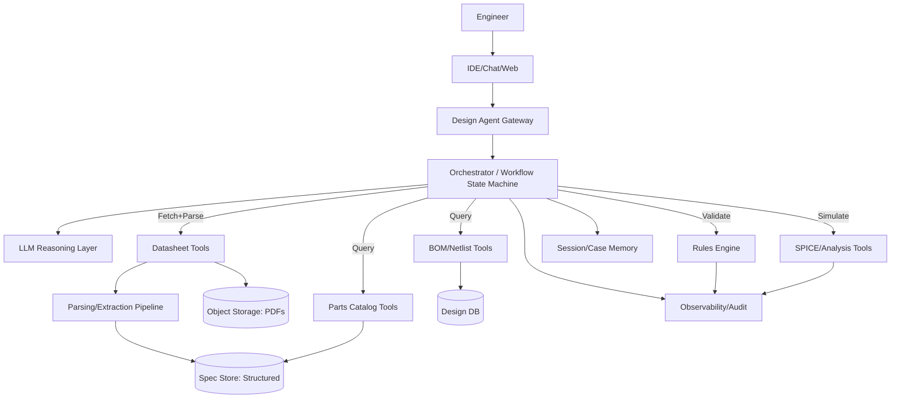
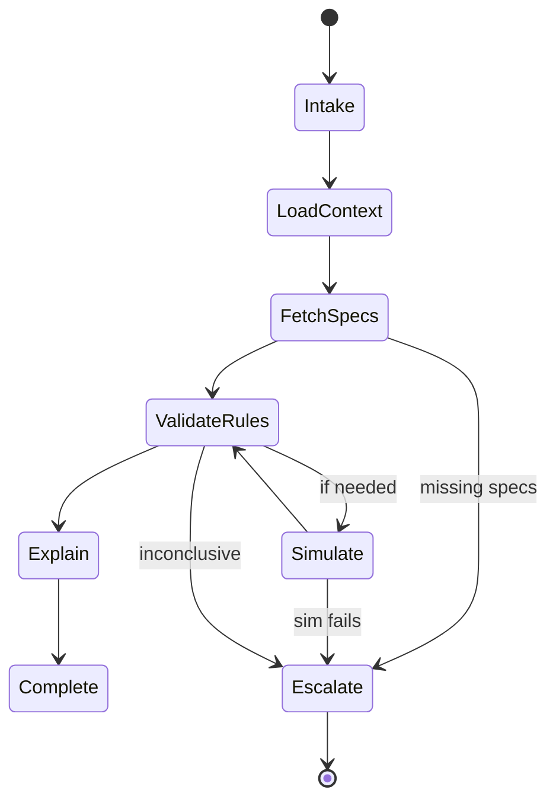
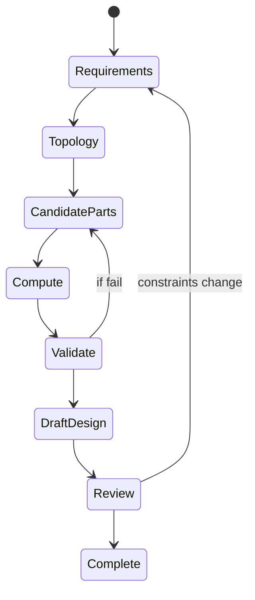
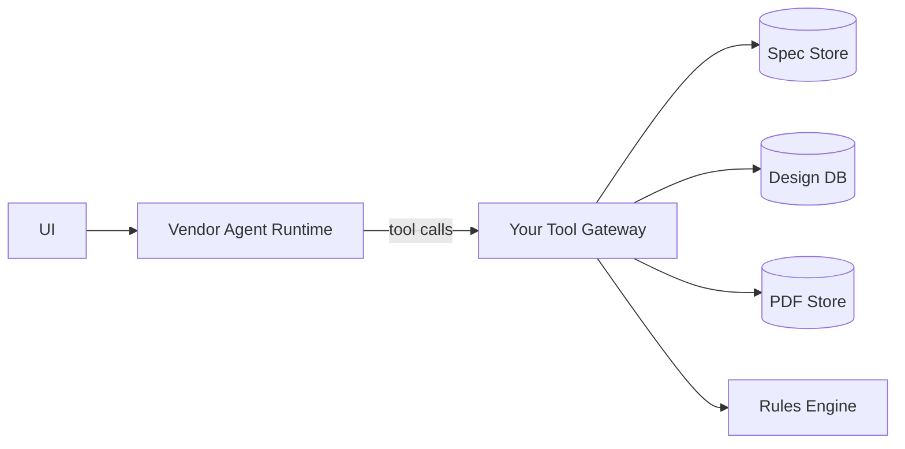
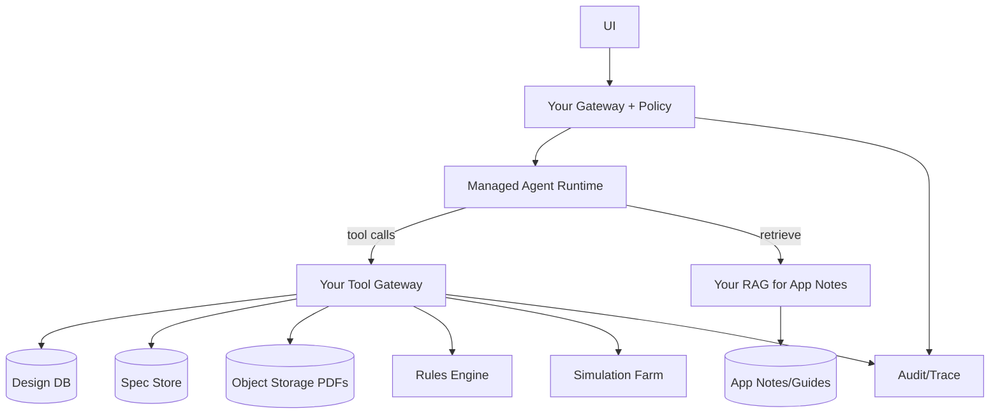
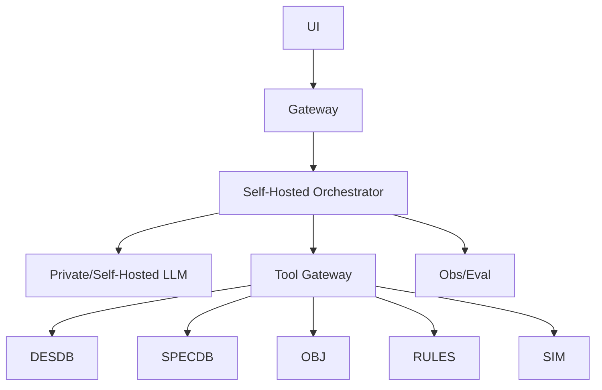

[Previous](12_02_travel_agent_architecture.md) | [Next](12_04_coding_agent_architecture.md)

# Electronics Design Agent Architecture  

## Table of Contents

- [0. What the electronics design agent must *actually* do (scope)](#0-what-the-electronics-design-agent-must-actually-do-scope)
  - [Explicit non‑goals (unless you accept liability)](#explicit-nongoals-unless-you-accept-liability)
- [1. Core truth: electronics is a constraints system](#1-core-truth-electronics-is-a-constraints-system)
- [2. Data sources and the right storage/retrieval approach](#2-data-sources-and-the-right-storageretrieval-approach)
  - [2.1 Systems of record (structured; query, don’t embed)](#21-systems-of-record-structured-query-dont-embed)
  - [2.2 Datasheets (semi‑structured; parse to structured fields)](#22-datasheets-semistructured-parse-to-structured-fields)
  - [2.3 Curves and charts (hard; don’t pretend otherwise)](#23-curves-and-charts-hard-dont-pretend-otherwise)
  - [2.4 Simulation results (deterministic)](#24-simulation-results-deterministic)
- [3. Operating model: evidence → rules → explanation](#3-operating-model-evidence-rules-explanation)
- [4. Reference architecture (common across deployment modes)](#4-reference-architecture-common-across-deployment-modes)
  - [4.1 High‑level block diagram](#41-highlevel-block-diagram)
  - [4.2 Responsibilities (non‑optional)](#42-responsibilities-nonoptional)
- [5. The “spec store” (the part you must build)](#5-the-spec-store-the-part-you-must-build)
  - [5.1 Minimum schema for common passives](#51-minimum-schema-for-common-passives)
  - [5.2 Minimum schema for ICs](#52-minimum-schema-for-ics)
  - [5.3 Versioning](#53-versioning)
- [6. Tool contracts (what the agent must call)](#6-tool-contracts-what-the-agent-must-call)
  - [6.1 Design context tools (read)](#61-design-context-tools-read)
  - [6.2 Parts/spec tools (read)](#62-partsspec-tools-read)
  - [6.3 Datasheet tools (fetch/parse)](#63-datasheet-tools-fetchparse)
  - [6.4 Rule validation tools (deterministic)](#64-rule-validation-tools-deterministic)
  - [6.5 Simulation/analysis tools (deterministic)](#65-simulationanalysis-tools-deterministic)
  - [6.6 Structured errors (mandatory)](#66-structured-errors-mandatory)
- [7. The rules engine (why you need it)](#7-the-rules-engine-why-you-need-it)
  - [7.1 Example rule categories](#71-example-rule-categories)
  - [7.2 Rule outputs must be explainable](#72-rule-outputs-must-be-explainable)
- [8. Retrieval strategy (what to vectorize and what not)](#8-retrieval-strategy-what-to-vectorize-and-what-not)
  - [8.1 Do NOT vectorize](#81-do-not-vectorize)
  - [8.2 Do vectorize (selectively)](#82-do-vectorize-selectively)
  - [8.3 Practical retrieval order](#83-practical-retrieval-order)
- [9. Orchestrator state machine](#9-orchestrator-state-machine)
  - [9.1 Validation workflow states](#91-validation-workflow-states)
  - [9.2 Design synthesis workflow states](#92-design-synthesis-workflow-states)
- [10. Three deployment options (what to choose and why)](#10-three-deployment-options-what-to-choose-and-why)
  - [10.1 Option A — Agent‑as‑a‑Service (managed)](#101-option-a-agentasaservice-managed)
  - [10.2 Option B — Hybrid (recommended for most serious engineering orgs)](#102-option-b-hybrid-recommended-for-most-serious-engineering-orgs)
  - [10.3 Option C — In‑house (only when forced)](#103-option-c-inhouse-only-when-forced)
- [11. Autonomy model (how far you should let it go)](#11-autonomy-model-how-far-you-should-let-it-go)
  - [11.1 Recommended tiers](#111-recommended-tiers)
- [12. Response contract (how the agent must answer)](#12-response-contract-how-the-agent-must-answer)
- [13. Safety, compliance, and liability](#13-safety-compliance-and-liability)
  - [13.1 Non‑negotiables](#131-nonnegotiables)
  - [13.2 Prompt injection considerations](#132-prompt-injection-considerations)
- [14. Observability and evaluation](#14-observability-and-evaluation)
  - [14.1 What to log](#141-what-to-log)
  - [14.2 Metrics](#142-metrics)
  - [14.3 Golden test suite](#143-golden-test-suite)
- [15. Common failure modes (what will break)](#15-common-failure-modes-what-will-break)
- [16. Recommended approach (summary)](#16-recommended-approach-summary)
- [Appendix A — Minimal implementation checklist](#appendix-a-minimal-implementation-checklist)
- [Appendix B — Suggested MCP packaging (optional)](#appendix-b-suggested-mcp-packaging-optional)


> **Use case #3:** Electronics Design Agent (component validation + design assistance + review)
>
> **Goal:** A production architecture blueprint with 3 deployment options (**Agent‑as‑a‑Service**, **Hybrid**, **In‑house**) and a recommended approach for most orgs.
>
> **Design stance:** Electronics agents fail when they treat datasheets as “text.” The truth lives in **tables, curves, constraints, and domain rules**. You need a **structured spec store + deterministic validators**. LLMs are good at *explaining* and *searching*, not at being the final authority.

---

## 0. What the electronics design agent must *actually* do (scope)

A useful electronics design agent should reliably support:

- **Part validation** in context:
  - “Is capacitor C12 valid here?”
  - “Is this LDO stable with my output cap + ESR?”
  - “Does MOSFET meet SOA at my load/thermal constraints?”

- **Design synthesis (assisted)**:
  - propose candidate topologies (buck/boost/LDO/isolated)
  - propose parts shortlist (controller + passives)
  - produce calculations (duty, ripple, inductor, cap, thermal budget)
  - generate preliminary BOM candidates

- **Design review / linting**:
  - check derating rules
  - check compatibility (voltage/current/temp/package)
  - check common mistakes (reverse polarity, missing pull‑ups, wrong footprint)

- **Evidence + traceability**:
  - cite datasheet sections and extracted fields
  - explain why a rule triggered
  - produce a PASS/FAIL/NEEDS‑REVIEW outcome

### Explicit non‑goals (unless you accept liability)
- Autonomous release sign‑off for safety‑critical designs
- Fabrication file generation without human review
- “Trust me” answers without evidence from tools and rules

---

## 1. Core truth: electronics is a constraints system

Electronics decisions are dominated by:
- max/min ratings (voltage, current, temp)
- derating (esp. caps, inductors)
- frequency‑dependent behavior (ESR/impedance)
- stability criteria (control loop + output network)
- thermal constraints
- supply chain constraints (lifecycle, alternates)

**Therefore:** retrieval must be **structured first**.

---

## 2. Data sources and the right storage/retrieval approach

### 2.1 Systems of record (structured; query, don’t embed)
- Parts catalog (MPN, manufacturer, params)
- BOM database
- Design database (schematic netlist, PCB layout metadata)
- Footprint library
- Supplier availability/pricing

**Retrieval style:** SQL/Graph queries with strict filters.

### 2.2 Datasheets (semi‑structured; parse to structured fields)
- PDF datasheets
- app notes
- reference designs

**Retrieval style:**
- object storage holds originals
- parsing pipeline extracts:
  - key param tables (Vrated, ESR range, ripple current)
  - absolute max ratings
  - recommended operating conditions
  - graphs/curves (optional extraction)

### 2.3 Curves and charts (hard; don’t pretend otherwise)
- capacitor DC bias curves
- impedance vs frequency
- MOSFET SOA curves
- thermal derating curves

**Retrieval style:**
- prefer vendor‑provided digital tables if available
- otherwise store as images with **human‑validated summaries**
- optionally use vision models to extract approximate points

### 2.4 Simulation results (deterministic)
- SPICE outputs
- loop stability metrics
- thermal simulation outputs

**Retrieval style:** store outputs as structured artifacts, not “text blobs.”

---

## 3. Operating model: evidence → rules → explanation

Electronics assistance should follow a strict flow:

1) **Identify** design context (net, voltage, ripple, ambient, load)
2) **Fetch** authoritative specs (catalog + parsed datasheet)
3) **Validate** with deterministic rules (PASS/FAIL)
4) **Simulate** when needed (SPICE/loop check)
5) **Explain** results with citations
6) **Escalate** when rules cannot conclude

**Key constraint:** LLM may propose candidates; a rules engine decides compliance.

---

## 4. Reference architecture (common across deployment modes)

### 4.1 High‑level block diagram



### 4.2 Responsibilities (non‑optional)
- **Gateway:** auth, project scoping, export controls, vendor NDA boundaries
- **Orchestrator:** deterministic loop control, tool budgets, stop conditions
- **Tool gateways:** stable contracts for catalog/BOM/docs/sim
- **Spec store:** structured, versioned parameter truth
- **Rules engine:** deterministic, explainable checks
- **Observability:** trace every rule fired and every spec source

---

## 5. The “spec store” (the part you must build)

A reliable electronics agent needs a **normalized parameter schema**.

### 5.1 Minimum schema for common passives
- **Capacitor:** type (MLCC/electrolytic), Vrated, capacitance, tolerance, ESR/ESL, ripple current, temp coeff, DC bias curve ref
- **Inductor:** inductance, Isat, Irms, DCR, core type, temp rise
- **Resistor:** value, tolerance, power, TCR, voltage rating

### 5.2 Minimum schema for ICs
- abs max ratings
- recommended operating conditions
- current limits
- switching frequency range
- compensation/stability notes
- package + thermal resistance

### 5.3 Versioning
- spec extraction is not perfect; store:
  - source doc id + version
  - extraction confidence
  - human‑verified fields flag

**Rule:** anything safety‑critical must be human‑verified.

---

## 6. Tool contracts (what the agent must call)

### 6.1 Design context tools (read)
- `design.get_bom(design_id) -> bom[]`
- `design.get_netlist(design_id) -> nets/components`
- `design.get_constraints(design_id) -> constraints` (Vin, Vout, Iout, ambient, efficiency targets)
- `library.get_footprint(refdes/mpn) -> footprint_id`

### 6.2 Parts/spec tools (read)
- `parts.get(mpn) -> structured_specs`
- `parts.search(filters) -> candidates[]`
- `supply.availability(mpn) -> stock/lifecycle`

### 6.3 Datasheet tools (fetch/parse)
- `docs.fetch(doc_id|mpn) -> pdf_ref`
- `docs.extract_tables(pdf_ref) -> tables`
- `docs.extract_params(pdf_ref, schema) -> structured_specs + citations`

### 6.4 Rule validation tools (deterministic)
- `rules.validate_capacitor(ctx, cap_specs) -> PASS|FAIL|REVIEW + reasons`
- `rules.validate_inductor(ctx, ind_specs) -> ...`
- `rules.validate_regulator_stability(ctx, ic_specs, output_network) -> ...`

### 6.5 Simulation/analysis tools (deterministic)
- `sim.spice_run(netlist_or_template, params) -> results`
- `sim.loop_stability(model, output_network) -> phase_margin/gain_margin`
- `calc.power_stage(Vin,Vout,Iout,f_sw,targets) -> computed_values`

### 6.6 Structured errors (mandatory)

```json
{
  "ok": false,
  "error": {
    "type": "NotFound|InvalidDesignContext|ParseFailed|RuleConfigMissing|SimulationFailed",
    "message": "...",
    "retryable": true,
    "details": {"mpn": "...", "doc_id": "..."}
  }
}
```

---

## 7. The rules engine (why you need it)

LLMs cannot be trusted to:
- apply derating correctly
- interpret abs max vs recommended operating conditions
- reason over curves without structured data

### 7.1 Example rule categories

**Electrical rating rules**
- Voltage derating (e.g., MLCC at 50–70% of Vrated depending on class)
- Current headroom (inductor Irms/Isat > peak current with margin)

**Stability rules**
- LDO requires ESR in range; cap type constraints
- Switcher compensation constraints

**Thermal rules**
- junction temperature estimation
- θJA limits with ambient

**Layout/footprint rules**
- footprint match
- polarity
- decoupling proximity constraints (if layout metadata available)

### 7.2 Rule outputs must be explainable
Output:
- status (PASS/FAIL/REVIEW)
- reasons with thresholds
- spec fields used
- citations

---

## 8. Retrieval strategy (what to vectorize and what not)

### 8.1 Do NOT vectorize
- raw spec tables as primary retrieval
- numeric limits that must be exact

### 8.2 Do vectorize (selectively)
- app notes
- troubleshooting guides
- reference design narratives
- “why this topology” text

### 8.3 Practical retrieval order
1) Structured catalog/spec store
2) If missing: datasheet parse
3) For explanations: RAG over app notes

---

## 9. Orchestrator state machine

### 9.1 Validation workflow states



### 9.2 Design synthesis workflow states



---

## 10. Three deployment options (what to choose and why)

### 10.1 Option A — Agent‑as‑a‑Service (managed)

**Best fit:**
- early internal tooling
- design reviews and Q&A
- low regulatory constraints



**Pros**
- fastest iteration
- minimal infra burden

**Cons**
- sensitive design/IP exposure risk
- limited control over orchestration and logging

**Use if:** designs are not highly sensitive and your tool gateway keeps all IP local.

---

### 10.2 Option B — Hybrid (recommended for most serious engineering orgs)

**Core idea:** managed reasoning; your environment controls design IP, rules, and evidence.



**Pros**
- strong IP boundary control
- deterministic validation stays local
- easier compliance and audit
- portability across vendors

**Cons**
- you must run spec parsing + rules + sim infrastructure

**Use if:** you care about correctness and IP protection (most electronics orgs do).

---

### 10.3 Option C — In‑house (only when forced)

**Best fit:**
- strict export controls / air‑gap
- safety‑critical programs
- extreme IP sensitivity
- desire for custom models trained on internal designs



**Pros**
- maximum control
- on‑prem/offline support

**Cons**
- heavy ops burden
- quality and eval become your job

---

## 11. Autonomy model (how far you should let it go)

### 11.1 Recommended tiers

**Tier 0 — Reviewer/assistant (read‑only)**
- validates parts
- explains issues
- proposes alternates

**Tier 1 — Change proposal (writes are drafts)**
- outputs BOM diffs
- proposes schematic edits (patches) but does not apply them

**Tier 2 — Tool‑applied edits (rare)**
- can apply changes in CAD tools via APIs
- requires approval + post‑checks

**Blunt rule:** most orgs stop at Tier 1.

---

## 12. Response contract (how the agent must answer)

Every answer should include:

1) **Verdict**: PASS / FAIL / NEEDS REVIEW
2) **Context**: what assumptions and design constraints were used
3) **Evidence**: spec fields + datasheet citations (doc section/page if available)
4) **Rule trace**: which rules fired and thresholds
5) **Next actions**: alternatives, tests, or simulation recommended

If evidence is missing, the agent must say:
- “Cannot conclude; missing DC bias curve / ESR range / thermal data. Escalating.”

---

## 13. Safety, compliance, and liability

Electronics design can be safety‑critical.

### 13.1 Non‑negotiables
- project scoping + access control
- audit of every spec source used
- disclaimers: assistance, not certification
- human review for:
  - medical, automotive, aerospace
  - high voltage / high power

### 13.2 Prompt injection considerations
Datasheets and notes can contain adversarial text.
Mitigation:
- never execute tool calls based on untrusted text
- treat retrieved text as evidence only
- tool gateway enforces permissions

---

## 14. Observability and evaluation

### 14.1 What to log
- design_id, version
- tool calls (redacted)
- extracted spec fields + confidence
- rules fired
- sim results snapshot

### 14.2 Metrics
- % validations with complete evidence
- false pass / false fail rates (from human review)
- time saved per review
- top failing rule categories

### 14.3 Golden test suite
- known “good” designs
- known “bad” designs
- edge cases (MLCC DC bias, LDO ESR windows, MOSFET SOA)

Run this suite on:
- rules updates
- parser updates
- model updates

---

## 15. Common failure modes (what will break)

- treating abs max as operating condition
- missing DC bias derating on MLCC → under‑capacitance
- ignoring ESR constraints → LDO oscillation
- using typical values instead of worst‑case
- parsing errors from PDFs silently

Mitigation: structured spec store, parser confidence, mandatory rule traces.

---

## 16. Recommended approach (summary)

For most electronics design agents:

- Choose **Hybrid**: managed reasoning + local spec/rules/sim/tool gateway
- Start at **Tier 0** (reviewer) and prove reliability
- Build a **spec store** and **rules engine** first
- Use RAG for narrative docs, not numeric truth
- Make answers evidence‑first with rule traces

---

## Appendix A — Minimal implementation checklist

- [ ] Design context tools (BOM/netlist/constraints)
- [ ] Spec store schema for top component classes
- [ ] Datasheet fetch + parse pipeline with confidence
- [ ] Deterministic rule engine with explainable outputs
- [ ] Optional SPICE integration for stability checks
- [ ] Audit logs and trace IDs
- [ ] Golden design suite and regression harness

---

## Appendix B — Suggested MCP packaging (optional)

If using MCP, expose 5 servers:
- `eda-design-read` (BOM/netlist/constraints)
- `eda-parts` (catalog/spec search)
- `eda-docs` (fetch/parse datasheets)
- `eda-rules` (validators)
- `eda-sim` (SPICE/loop/thermal)

Allowlist per project and enforce Tier limits in the orchestrator.

[Previous](12_02_travel_agent_architecture.md) | [Next](12_04_coding_agent_architecture.md)
