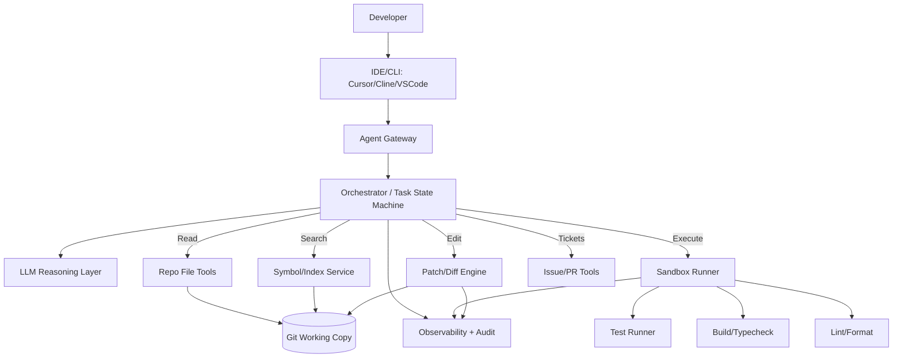
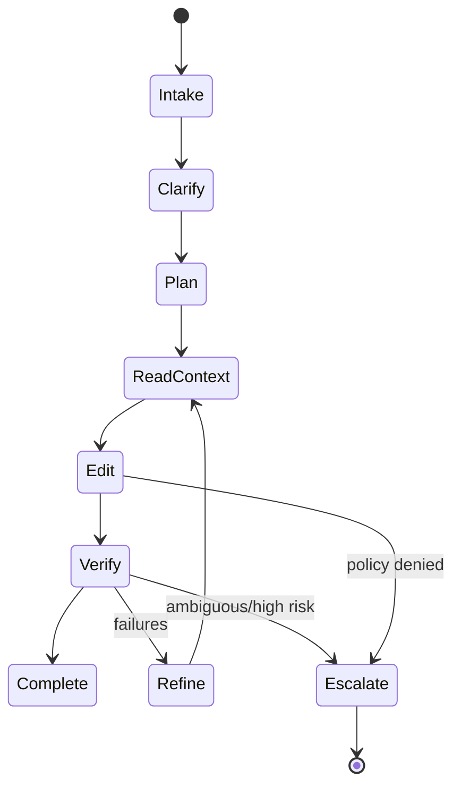
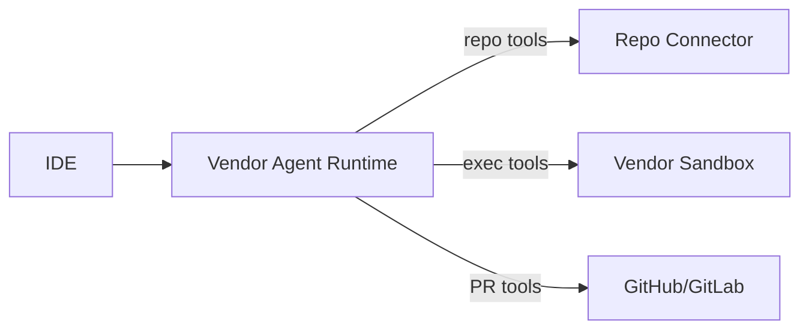
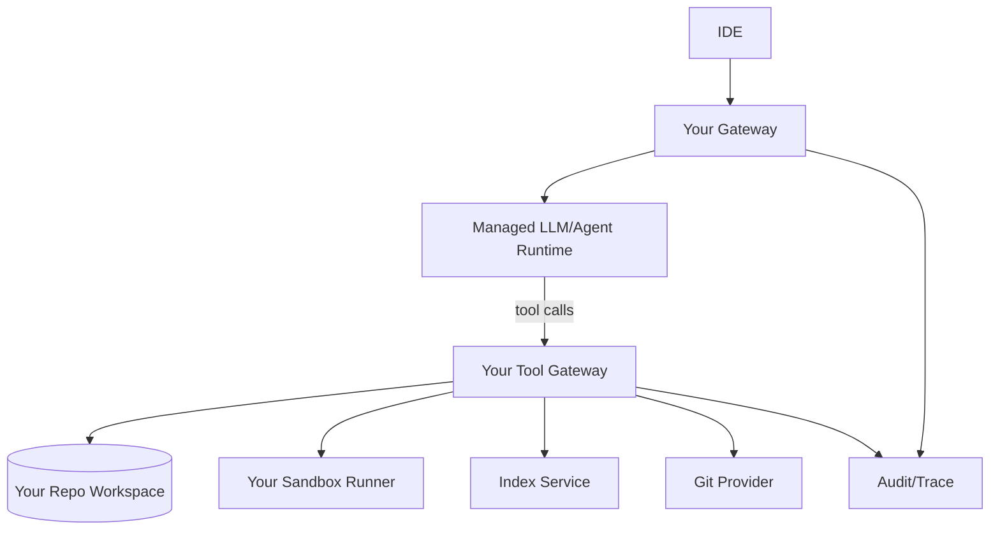
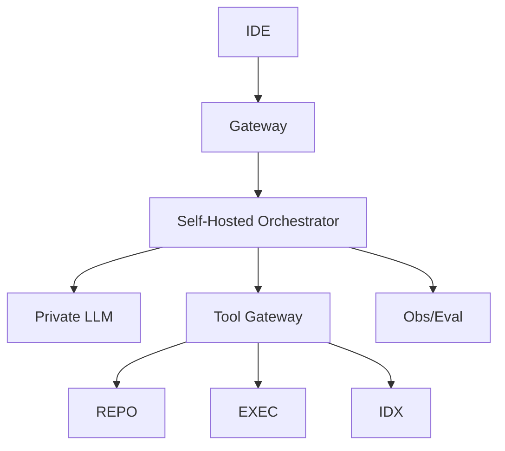

[Previous](12_03_electronics_design_agent_architecture.md) | [Next](12_05_medical_agent_architecture.md)

# Coding Agent Architecture  

## Table of Contents

- [0. What the coding agent must *actually* do (scope)](#0-what-the-coding-agent-must-actually-do-scope)
  - [Explicit non‑goals (unless you want outages)](#explicit-nongoals-unless-you-want-outages)
- [1. The core loop: Plan → Verify → Refine](#1-the-core-loop-plan-verify-refine)
- [2. Data sources and the right retrieval approach](#2-data-sources-and-the-right-retrieval-approach)
  - [2.1 Repository content (primary)](#21-repository-content-primary)
  - [2.2 Build/test signals (primary verification)](#22-buildtest-signals-primary-verification)
  - [2.3 External knowledge (optional)](#23-external-knowledge-optional)
  - [2.4 Historical context (secondary)](#24-historical-context-secondary)
- [3. Reference architecture (common across deployment modes)](#3-reference-architecture-common-across-deployment-modes)
  - [3.1 High‑level block diagram](#31-highlevel-block-diagram)
  - [3.2 Component responsibilities](#32-component-responsibilities)
- [4. The execution harness (the make‑or‑break layer)](#4-the-execution-harness-the-makeorbreak-layer)
  - [4.1 Mandatory capabilities](#41-mandatory-capabilities)
  - [4.2 Sandboxing requirements](#42-sandboxing-requirements)
  - [4.3 Deterministic reporting](#43-deterministic-reporting)
- [5. Tool contracts (what the agent must call)](#5-tool-contracts-what-the-agent-must-call)
  - [5.1 Repo read tools](#51-repo-read-tools)
  - [5.2 Edit tools (diff‑first)](#52-edit-tools-difffirst)
  - [5.3 Execution tools](#53-execution-tools)
  - [5.4 Git/PR tools](#54-gitpr-tools)
  - [5.5 Structured errors (mandatory)](#55-structured-errors-mandatory)
- [6. Orchestrator state machine (how to prevent chaos)](#6-orchestrator-state-machine-how-to-prevent-chaos)
  - [6.1 State diagram](#61-state-diagram)
  - [6.2 Stop conditions (budgets)](#62-stop-conditions-budgets)
- [7. Context strategy (how it “understands” a repo)](#7-context-strategy-how-it-understands-a-repo)
  - [7.1 The repo understanding stack](#71-the-repo-understanding-stack)
  - [7.2 What to store vs compute](#72-what-to-store-vs-compute)
  - [7.3 Avoid the common trap](#73-avoid-the-common-trap)
- [8. Guardrails and policy (the safety layer)](#8-guardrails-and-policy-the-safety-layer)
  - [8.1 Non‑negotiable guardrails](#81-nonnegotiable-guardrails)
  - [8.2 High‑risk changes require approvals](#82-highrisk-changes-require-approvals)
- [9. Three deployment options (what to choose and why)](#9-three-deployment-options-what-to-choose-and-why)
  - [9.1 Option A — Agent‑as‑a‑Service (managed)](#91-option-a-agentasaservice-managed)
  - [9.2 Option B — Hybrid (recommended)](#92-option-b-hybrid-recommended)
  - [9.3 Option C — In‑house (only when forced)](#93-option-c-inhouse-only-when-forced)
- [10. Autonomy model (how far you should let it go)](#10-autonomy-model-how-far-you-should-let-it-go)
  - [10.1 Recommended tiers](#101-recommended-tiers)
- [11. Response contract (how it must report work)](#11-response-contract-how-it-must-report-work)
- [12. Observability and evaluation](#12-observability-and-evaluation)
  - [12.1 What to log](#121-what-to-log)
  - [12.2 Metrics](#122-metrics)
  - [12.3 Golden tasks suite](#123-golden-tasks-suite)
- [13. Common failure modes (what will break)](#13-common-failure-modes-what-will-break)
- [14. Recommended approach (summary)](#14-recommended-approach-summary)
- [Appendix A — Minimal implementation checklist](#appendix-a-minimal-implementation-checklist)
- [Appendix B — Suggested MCP packaging (optional)](#appendix-b-suggested-mcp-packaging-optional)


> **Use case #4:** Coding Agent (Cline/Cursor‑style) — implement, refactor, debug, test, and ship code changes.
>
> **Goal:** A production architecture blueprint with 3 deployment options (**Agent‑as‑a‑Service**, **Hybrid**, **In‑house**) plus a recommended approach for most teams.
>
> **Design stance:** A coding agent is only as good as its **execution harness** (tests/build/lint), **repo understanding**, and **guardrails**. Without deterministic verification, it becomes a confident text generator.

---

## 0. What the coding agent must *actually* do (scope)

A useful coding agent should reliably support:

- **Change implementation**: new features, bug fixes, integrations
- **Refactoring**: safe transforms with tests and minimal diffs
- **Debugging**: reproduce failures, inspect logs, propose and apply fixes
- **Testing**: add/update tests, run suites, interpret failures
- **Dependency/workspace changes**: config updates, CI fixes, build scripts
- **Code review assistance**: rationale, risk notes, rollout plan

### Explicit non‑goals (unless you want outages)
- Writing to production systems
- Large‑scale destructive refactors without approvals
- Editing secrets or credentials
- “Fix everything” without a spec / acceptance criteria

---

## 1. The core loop: Plan → Verify → Refine

A coding agent must operate like a disciplined engineer:

1) **Plan**: decide steps and files to touch
2) **Act**: apply changes as diffs
3) **Verify**: run tests/build/lint, check acceptance criteria
4) **Refine**: adjust based on failures until the change is correct

> **Hard rule:** If it didn’t pass verification, it isn’t done.

---

## 2. Data sources and the right retrieval approach

Coding is multi‑modal in practice:

### 2.1 Repository content (primary)
- source files
- tests
- configs (CI, Docker, IaC)
- docs and ADRs

**Retrieval style:** deterministic file reads + symbol search + dependency graph.

### 2.2 Build/test signals (primary verification)
- unit/integration tests
- compiler errors
- lint/type checks
- runtime logs from local repro

**Retrieval style:** tool execution + structured parsing.

### 2.3 External knowledge (optional)
- library docs, API references
- error message lookups

**Retrieval style:** explicit web/doc tools; avoid mixing into repo truth.

### 2.4 Historical context (secondary)
- git history
- prior PRs
- issue tracker tickets

**Retrieval style:** metadata filter + diff summaries.

---

## 3. Reference architecture (common across deployment modes)

### 3.1 High‑level block diagram



### 3.2 Component responsibilities

- **Gateway**: auth, workspace selection, rate limits, redaction rules
- **Orchestrator**: deterministic loop control, budgets, approvals, stop conditions
- **Index service**: fast symbol lookup (ripgrep/ctags/LSIF), dependency graph
- **Patch engine**: apply minimal diffs, keep patches reviewable
- **Sandbox runner**: run commands safely with resource limits
- **Issue/PR tools**: open PR, comment, fetch acceptance criteria
- **Observability**: trace steps, record diffs, commands executed, outcomes

---

## 4. The execution harness (the make‑or‑break layer)

A coding agent must run real commands. Otherwise it guesses.

### 4.1 Mandatory capabilities
- `run_tests` (unit + targeted)
- `run_build` / `typecheck`
- `run_lint` / `format_check`
- `run_app` / `repro_script` (when debugging)

### 4.2 Sandboxing requirements
- resource limits (CPU/mem/time)
- filesystem scoping (repo only)
- network policy (often off by default)
- secrets isolation

### 4.3 Deterministic reporting
Tool outputs must be structured:
- exit code
- stdout/stderr (truncated)
- parsed error list (file/line/message)

---

## 5. Tool contracts (what the agent must call)

### 5.1 Repo read tools
- `repo.list_files(glob) -> files[]`
- `repo.read(path, range?) -> text`
- `repo.search(query, scope) -> matches[]`
- `repo.symbol_lookup(symbol) -> locations[]`

### 5.2 Edit tools (diff‑first)
- `repo.apply_patch(unified_diff) -> result`
- `repo.create_file(path, content) -> result`
- `repo.move(path_from, path_to) -> result`

**Rule:** prefer patches over raw rewrite.

### 5.3 Execution tools
- `exec.run(cmd, cwd, env_sanitized, timeout) -> {exit, logs, parsed_errors}`
- `exec.run_tests(target?) -> ...`
- `exec.run_lint(scope?) -> ...`

### 5.4 Git/PR tools
- `git.status() -> changes`
- `git.diff() -> diff`
- `git.commit(message) -> sha` (optional)
- `pr.open(title, body, diff) -> pr_url`

### 5.5 Structured errors (mandatory)

```json
{
  "ok": false,
  "error": {
    "type": "FileNotFound|PatchRejected|CommandFailed|Timeout|PolicyDenied",
    "message": "...",
    "retryable": true,
    "details": {"path": "...", "cmd": "..."}
  }
}
```

---

## 6. Orchestrator state machine (how to prevent chaos)

### 6.1 State diagram



### 6.2 Stop conditions (budgets)
- max iterations (e.g., 5 loops)
- max files changed
- max runtime
- max external calls

When budgets are hit: produce best current diagnosis + next steps.

---

## 7. Context strategy (how it “understands” a repo)

### 7.1 The repo understanding stack
1) **Fast search** (ripgrep) for recall
2) **Symbol index** (ctags/LSIF/LSP) for precision
3) **Dependency graph** (imports/build graph)
4) **Test mapping** (which tests cover which modules)

### 7.2 What to store vs compute
- Compute on demand: search results, symbol locations
- Store: small summaries (module responsibilities), ADR titles, build commands

### 7.3 Avoid the common trap
Do not dump the entire repo into context.
Use retrieval and focus on the slice relevant to the change.

---

## 8. Guardrails and policy (the safety layer)

### 8.1 Non‑negotiable guardrails
- **No secret exposure** (block reading `.env`, vault files unless explicitly allowed)
- **No destructive commands** (rm -rf, format entire repo) without approval
- **No network by default** (unless needed for dependency install)
- **Diff limits** (max lines changed)
- **Path allowlist** (workspace scoping)

### 8.2 High‑risk changes require approvals
Examples:
- security/auth code
- payment logic
- infra/IaC changes
- schema migrations

Mechanism:
- agent prepares PR + risk notes
- human approves before merge

---

## 9. Three deployment options (what to choose and why)

### 9.1 Option A — Agent‑as‑a‑Service (managed)

**Best fit:**
- small teams
- quick productivity wins
- low compliance burden



**Pros**
- fastest to adopt
- minimal infra to run

**Cons (real)**
- repo/IP exposure concerns
- limited control over sandbox policies
- audit depth varies by vendor

**Use if:** repo is non‑sensitive and you can accept vendor sandboxing.

---

### 9.2 Option B — Hybrid (recommended)

**Core idea:** managed reasoning, but **execution + repo access stays in your environment**.



**Pros**
- strong IP boundary control
- you enforce sandbox/network/secrets policies
- portability across vendors/models

**Cons**
- you must run tooling (sandbox, index)

**Use if:** you care about security, policy, and consistent verification (most orgs).

---

### 9.3 Option C — In‑house (only when forced)

**Best fit:**
- strict data residency / air‑gap
- highly sensitive repos
- need custom orchestration and eval



**Pros**
- maximum control
- offline support

**Cons**
- heavy ops burden
- quality and eval become your job

---

## 10. Autonomy model (how far you should let it go)

### 10.1 Recommended tiers

**Tier 0 — Read‑only reviewer**
- explains code
- suggests diffs
- no writes

**Tier 1 — Patch author (recommended default)**
- applies diffs
- runs tests
- opens PR

**Tier 2 — PR shepherd**
- iterates based on CI
- updates PR
- still requires human merge

**Tier 3 — Auto‑merge (rare)**
- only for low‑risk repos with strong tests
- strict policies and rollback

**Blunt rule:** most teams should stop at Tier 2.

---

## 11. Response contract (how it must report work)

Every completed task should include:

1) **What changed** (files + high‑level summary)
2) **Why** (rationale mapped to acceptance criteria)
3) **Diff** (or PR link)
4) **Verification** (tests/build/lint run + results)
5) **Risks** (edge cases, rollout notes)
6) **Next steps** (if partial)

If tests weren’t run, it must say why.

---

## 12. Observability and evaluation

### 12.1 What to log
- prompts (redacted)
- files read
- patches applied
- commands executed
- verification outcomes
- iteration count

### 12.2 Metrics
- tasks completed per hour
- test pass rate after changes
- PR acceptance rate
- rework rate
- average loop iterations
- average diff size

### 12.3 Golden tasks suite
Create a regression harness:
- bug fixes with known failing tests
- small refactors
- dependency updates
- CI config fixes

Run the suite on:
- model updates
- tool changes
- sandbox changes

---

## 13. Common failure modes (what will break)

- **No tests** → agent ships plausible but broken code
- **Over‑editing** → huge diffs, unreviewable PRs
- **Context miss** → changes wrong module
- **Build env mismatch** → passes locally, fails CI
- **Secret leakage** → reads env files or logs tokens

Mitigation: strict patch policy, verification, sandbox policy, diff limits.

---

## 14. Recommended approach (summary)

For most teams building/using a coding agent:

- Choose **Hybrid**: managed reasoning + your repo + your sandbox + your index
- Default to **Tier 1** (patch + tests + PR)
- Enforce **Plan → Verify → Refine** with budgets
- Make verification outputs first‑class
- Keep diffs small and reviewable

---

## Appendix A — Minimal implementation checklist

- [ ] Repo read/search + symbol index
- [ ] Patch/diff application
- [ ] Sandbox runner with limits
- [ ] Test/build/lint commands encoded per repo
- [ ] PR creation + templates
- [ ] Policy engine (paths, diff size, secrets)
- [ ] Observability + eval harness

---

## Appendix B — Suggested MCP packaging (optional)

If using MCP, expose 4 servers:
- `code-repo` (read/write patches)
- `code-exec` (sandbox runner)
- `code-index` (symbol/dependency)
- `code-pr` (PR/issues)

Allowlist per repo and enforce autonomy tier limits in the orchestrator.

[Previous](12_03_electronics_design_agent_architecture.md) | [Next](12_05_medical_agent_architecture.md)
