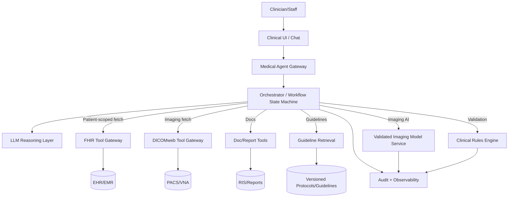
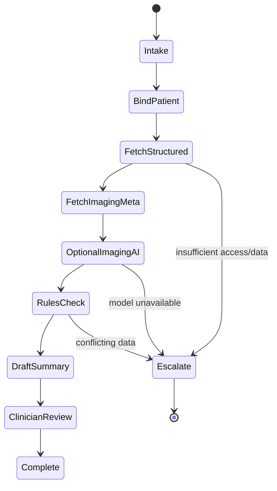
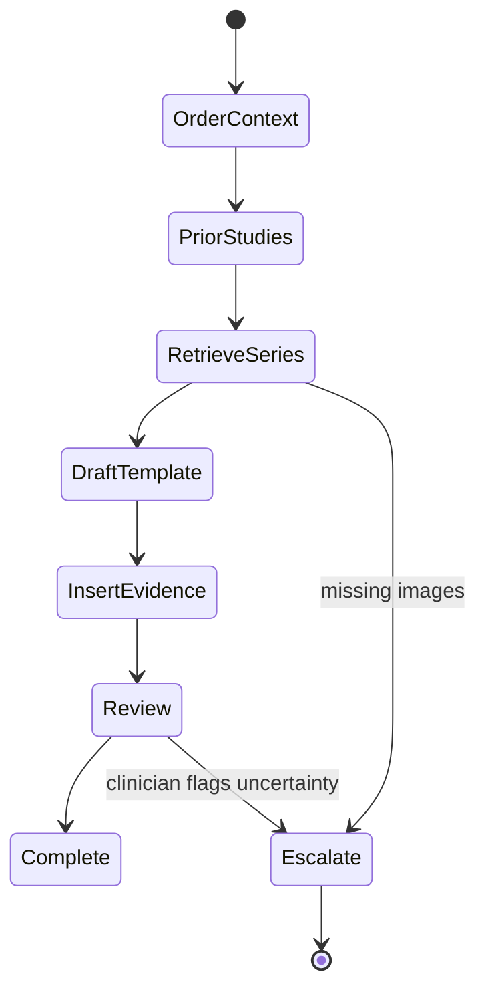
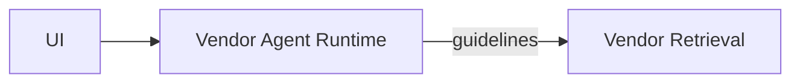
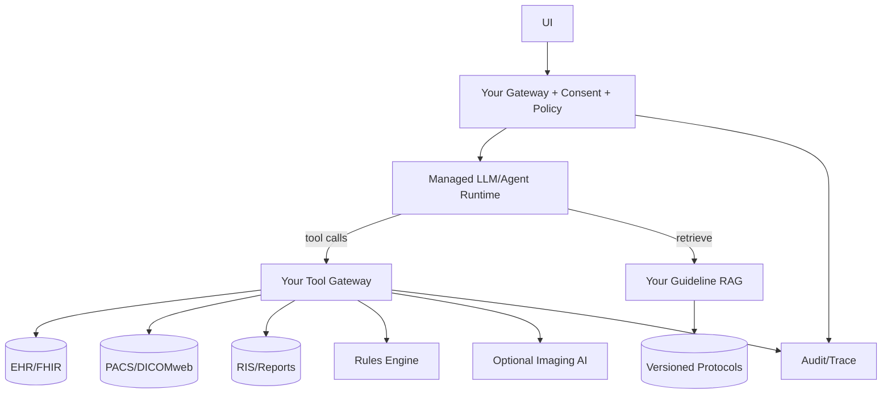
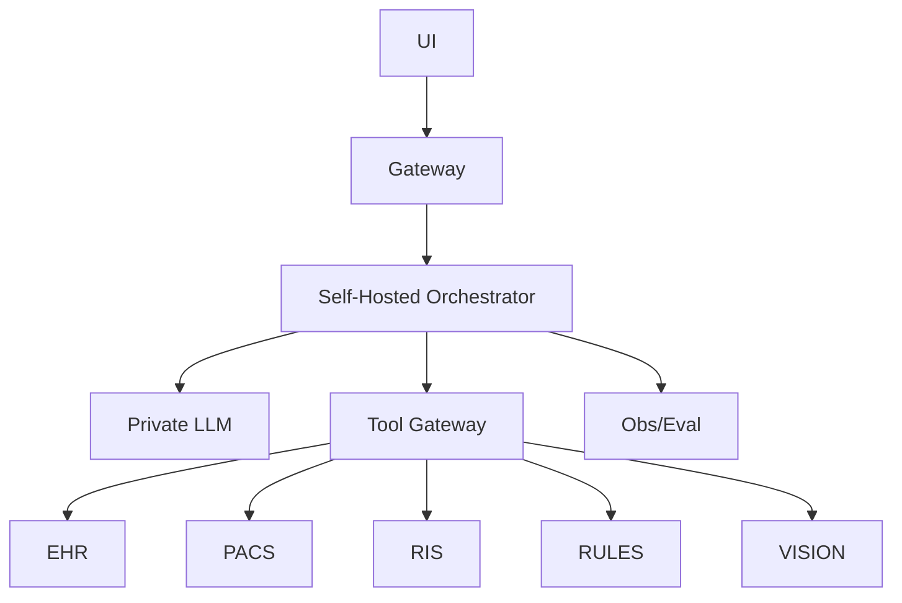

[Previous](12_04_coding_agent_architecture.md) | [Next](12_06_ops_troubleshooting_agent_architecture.md)

# Medical Agent Architecture  

## Table of Contents

- [0. What this agent must (and must not) do](#0-what-this-agent-must-and-must-not-do)
  - [0.1 Safe, high‑value tasks](#01-safe-highvalue-tasks)
  - [0.2 Tasks that require strict constraints / human sign‑off](#02-tasks-that-require-strict-constraints-human-signoff)
  - [0.3 Hard non‑goals](#03-hard-nongoals)
- [1. Medical data reality: where truth lives](#1-medical-data-reality-where-truth-lives)
- [2. Data types and where they should live](#2-data-types-and-where-they-should-live)
  - [2.1 Imaging (X‑ray/CT/MRI)](#21-imaging-xrayctmri)
  - [2.2 Reports (radiology, pathology)](#22-reports-radiology-pathology)
  - [2.3 Notes (clinical notes, discharge summaries)](#23-notes-clinical-notes-discharge-summaries)
  - [2.4 Labs/vitals/meds/allergies](#24-labsvitalsmedsallergies)
  - [2.5 Guidelines/protocols](#25-guidelinesprotocols)
- [3. Reference architecture (common across deployment modes)](#3-reference-architecture-common-across-deployment-modes)
  - [3.1 High‑level block diagram](#31-highlevel-block-diagram)
  - [3.2 Component responsibilities](#32-component-responsibilities)
- [4. The orchestrator: your safety and reliability backbone](#4-the-orchestrator-your-safety-and-reliability-backbone)
  - [4.1 State machine (clinical summary / triage)](#41-state-machine-clinical-summary-triage)
  - [4.2 State machine (report drafting)](#42-state-machine-report-drafting)
  - [4.3 Non‑negotiable stop conditions](#43-nonnegotiable-stop-conditions)
- [5. Tool contracts (what the agent must call)](#5-tool-contracts-what-the-agent-must-call)
  - [5.1 Patient binding and authorization](#51-patient-binding-and-authorization)
  - [5.2 FHIR tools (structured)](#52-fhir-tools-structured)
  - [5.3 Imaging tools (DICOM)](#53-imaging-tools-dicom)
  - [5.4 Reports/docs tools](#54-reportsdocs-tools)
  - [5.5 Guideline retrieval (RAG)](#55-guideline-retrieval-rag)
  - [5.6 Imaging AI (optional; validated)](#56-imaging-ai-optional-validated)
  - [5.7 Rules engine (deterministic)](#57-rules-engine-deterministic)
  - [5.8 Structured errors (mandatory)](#58-structured-errors-mandatory)
- [6. Retrieval strategy: what to vectorize vs not (thumb rules)](#6-retrieval-strategy-what-to-vectorize-vs-not-thumb-rules)
  - [6.1 Do NOT vectorize (query deterministically)](#61-do-not-vectorize-query-deterministically)
  - [6.2 Vectorize selectively (only when it adds value)](#62-vectorize-selectively-only-when-it-adds-value)
  - [6.3 Imaging embeddings (separate track)](#63-imaging-embeddings-separate-track)
- [7. Guardrails (this is where medical systems live or die)](#7-guardrails-this-is-where-medical-systems-live-or-die)
  - [7.1 Safety policies](#71-safety-policies)
  - [7.2 PHI rules](#72-phi-rules)
  - [7.3 Prompt injection / untrusted content](#73-prompt-injection-untrusted-content)
  - [7.4 Action gating](#74-action-gating)
- [8. Three deployment options (what to choose and why)](#8-three-deployment-options-what-to-choose-and-why)
  - [8.1 Option A — Agent‑as‑a‑Service (managed)](#81-option-a-agentasaservice-managed)
  - [8.2 Option B — Hybrid (recommended for most real deployments)](#82-option-b-hybrid-recommended-for-most-real-deployments)
  - [8.3 Option C — In‑house (only when forced)](#83-option-c-inhouse-only-when-forced)
- [9. Autonomy model (how far you should let it go)](#9-autonomy-model-how-far-you-should-let-it-go)
  - [9.1 Recommended tiers](#91-recommended-tiers)
- [10. Response contract (how the agent must answer)](#10-response-contract-how-the-agent-must-answer)
- [11. Observability and audit (mandatory)](#11-observability-and-audit-mandatory)
  - [11.1 What to log (with redaction)](#111-what-to-log-with-redaction)
  - [11.2 Metrics](#112-metrics)
- [12. Evaluation (how you keep it safe)](#12-evaluation-how-you-keep-it-safe)
  - [12.1 Golden scenarios](#121-golden-scenarios)
  - [12.2 What to measure](#122-what-to-measure)
- [13. Common failure modes (what will break)](#13-common-failure-modes-what-will-break)
- [14. Recommended approach (summary)](#14-recommended-approach-summary)
- [Appendix A — Minimal implementation checklist](#appendix-a-minimal-implementation-checklist)
- [Appendix B — Suggested MCP packaging (optional)](#appendix-b-suggested-mcp-packaging-optional)


> **Use case #5:** Medical Agent (X‑ray/MRI/CT + clinical notes + reports)
>
> **Goal:** A production architecture blueprint with 3 deployment options (**Agent‑as‑a‑Service**, **Hybrid**, **In‑house**) plus a recommended approach for most orgs.
>
> **Design stance (brutal):** If you let an LLM “interpret” medical images or make diagnostic claims without deterministic controls, you’re building a lawsuit. A medical agent should behave like **clinical decision support**: it **retrieves**, **structures**, **triages**, **drafts**, and **cites** — and it must **escalate to a clinician** for interpretation and sign‑off.

---

## 0. What this agent must (and must not) do

### 0.1 Safe, high‑value tasks
- **Summarize** patient history, meds, allergies, labs, vitals, prior imaging reports
- **Retrieve** relevant prior studies ("compare with CT 2024‑11‑03")
- **Draft** radiology report templates (sections, findings placeholders)
- **Highlight** abnormalities *as candidates* based on validated models + rules
- **Explain** guideline‑based next steps with citations ("per guideline X…")
- **Admin tasks**: coding hints, prior auth packet drafts, discharge instructions drafts

### 0.2 Tasks that require strict constraints / human sign‑off
- Any **diagnosis** or definitive interpretation
- Any **treatment recommendation** or medication change
- Any “ignore clinician judgement” framing

### 0.3 Hard non‑goals
- Autonomous diagnosis or treatment
- Unreviewed radiology reads
- Storing PHI in model memory outside governed stores

---

## 1. Medical data reality: where truth lives

Medical workflows span **multiple systems of record**:

- **PACS/VNA**: imaging storage (DICOM series)
- **RIS**: radiology workflow
- **EHR/EMR**: notes, orders, meds, allergies
- **LIS**: lab results
- **Billing**: ICD/CPT codes
- **Guidelines**: internal protocols + external guidance

**Blunt rule:** Don’t vectorize your way out of this. Most truth is **structured + permissioned** and must be fetched with deterministic tools.

---

## 2. Data types and where they should live

### 2.1 Imaging (X‑ray/CT/MRI)
- **Store:** PACS/VNA (DICOM)
- **Fetch:** DICOMweb (WADO‑RS/QIDO‑RS/STOW‑RS) or vendor APIs
- **Process:** specialized imaging pipeline (window/level, series selection)

**Vectorize?**
- Do **not** treat raw DICOM as “documents to embed.”
- If you need similarity search, use **image embeddings** from validated vision models and store embeddings separately, linked by study/series UID.

### 2.2 Reports (radiology, pathology)
- **Store:** EHR/RIS + document store
- **Search:** lexical + structured fields (modality, body part, impression)

**Vectorize?**
- Yes, selectively: impressions/findings for semantic retrieval, but keep patient scoping strict.

### 2.3 Notes (clinical notes, discharge summaries)
- **Store:** EHR (FHIR DocumentReference/Observation/Condition)
- **Search:** keyword + sectioned parsing (HPI/Assessment/Plan)

**Vectorize?**
- Yes, selectively for “similar cases” *inside the same org* with de‑identification; otherwise high risk.

### 2.4 Labs/vitals/meds/allergies
- **Store:** LIS/EHR (structured)
- **Fetch:** FHIR APIs (Observation/MedicationRequest/AllergyIntolerance)

**Vectorize?**
- Usually no. Query deterministically.

### 2.5 Guidelines/protocols
- **Store:** controlled knowledge base (versioned)

**Vectorize?**
- Yes (RAG), but enforce **version + region + institution** filters.

---

## 3. Reference architecture (common across deployment modes)

### 3.1 High‑level block diagram



### 3.2 Component responsibilities
- **Gateway:** auth, consent, patient context binding, PHI redaction policies
- **Orchestrator:** deterministic workflow, step budgets, “no diagnosis” policies
- **FHIR tools:** authoritative structured data fetch
- **DICOM tools:** study/series retrieval, rendering, metadata
- **Imaging model service:** optional, validated model outputs only
- **Rules engine:** deterministic checks (contraindications, threshold alerts)
- **Guideline RAG:** citations for policy/protocol content
- **Audit:** patient access log + tool call trace + model usage trace

---

## 4. The orchestrator: your safety and reliability backbone

### 4.1 State machine (clinical summary / triage)



### 4.2 State machine (report drafting)



### 4.3 Non‑negotiable stop conditions
- if patient binding fails → stop
- if data access scope uncertain → stop
- if asked for diagnosis/treatment → refuse + route to clinician

---

## 5. Tool contracts (what the agent must call)

### 5.1 Patient binding and authorization
- `auth.bind_patient(user_id, patient_id, reason) -> scope_token`
- `auth.check_consent(patient_id, purpose) -> allowed/denied`

### 5.2 FHIR tools (structured)
- `fhir.get_patient(scope_token) -> demographics`
- `fhir.get_problems(scope_token) -> conditions[]`
- `fhir.get_meds(scope_token) -> meds[]`
- `fhir.get_allergies(scope_token) -> allergies[]`
- `fhir.get_observations(scope_token, types, date_range) -> obs[]`

### 5.3 Imaging tools (DICOM)
- `dicom.search_studies(scope_token, modality, body_part, date_range) -> studies[]`
- `dicom.get_series(scope_token, study_uid) -> series[]`
- `dicom.render_frame(scope_token, series_uid, frame_idx, window_level) -> image_ref`

### 5.4 Reports/docs tools
- `reports.get_radiology_report(scope_token, study_uid) -> report_text + metadata`
- `docs.search(scope_token, query, filters) -> doc_refs[]`
- `docs.read(scope_token, doc_ref) -> text`

### 5.5 Guideline retrieval (RAG)
- `guidelines.search(query, version, facility, specialty) -> passages[] + citations`

### 5.6 Imaging AI (optional; validated)
- `vision.infer(series_ref, model_id, calibration_version) -> findings_structured`

### 5.7 Rules engine (deterministic)
- `rules.check_contraindications(meds, allergies, conditions) -> alerts[]`
- `rules.check_lab_thresholds(obs) -> alerts[]`

### 5.8 Structured errors (mandatory)

```json
{
  "ok": false,
  "error": {
    "type": "AccessDenied|ConsentMissing|PatientNotBound|NotFound|ToolTimeout|VendorDown",
    "message": "...",
    "retryable": true,
    "details": {"patient_id": "...", "study_uid": "..."}
  }
}
```

---

## 6. Retrieval strategy: what to vectorize vs not (thumb rules)

### 6.1 Do NOT vectorize (query deterministically)
- labs/vitals/meds/allergies (FHIR)
- encounter timelines
- imaging metadata (modality/date/body part)

### 6.2 Vectorize selectively (only when it adds value)
- radiology impressions/findings text for “similar prior cases” **within scope**
- guideline text (RAG)
- internal protocols

### 6.3 Imaging embeddings (separate track)
Use only if:
- you have validated models
- you can link embeddings to study/series UIDs
- you enforce patient scope and audit

**Do not** allow cross‑patient similarity search by default.

---

## 7. Guardrails (this is where medical systems live or die)

### 7.1 Safety policies
- “No diagnosis / no treatment” output policy unless explicitly configured as regulated CDS
- Always present outputs as:
  - **summary**
  - **candidates**
  - **evidence**
  - **uncertainties**
  - **next recommended clinician action** (not patient action)

### 7.2 PHI rules
- minimum necessary data in prompts
- redaction of identifiers in logs
- strict retention windows
- encryption at rest/in transit

### 7.3 Prompt injection / untrusted content
- treat notes and documents as evidence only
- never allow retrieved text to trigger tool calls without orchestrator validation

### 7.4 Action gating
Even “low risk” actions (ordering tests, messaging patients) require clinician confirmation.

---

## 8. Three deployment options (what to choose and why)

### 8.1 Option A — Agent‑as‑a‑Service (managed)

**Best fit:**
- non‑PHI workflows (public guidelines Q&A)
- administrative drafting without patient data



**Pros**
- fastest to deploy

**Cons (serious)**
- PHI exposure risk
- complex compliance boundary

**Use only if:** no PHI crosses the boundary.

---

### 8.2 Option B — Hybrid (recommended for most real deployments)

Managed reasoning + **your** patient‑scoped tools and audit.



**Pros**
- PHI stays within controlled boundary
- strong patient scoping and auditing
- vendor portability

**Cons**
- you must run tool gateway + audit + RAG

---

### 8.3 Option C — In‑house (only when forced)

**Best fit:**
- strict residency / air‑gap
- institutional policy requires full control
- large imaging AI footprint



**Pros**
- maximum control

**Cons**
- heavy ops + validation burden

---

## 9. Autonomy model (how far you should let it go)

### 9.1 Recommended tiers

**Tier 0 — Summarize + retrieve + draft (safe default)**
- no clinical decisions

**Tier 1 — Decision support (CDS) with guardrails**
- candidate flags + citations
- clinician sign‑off required

**Tier 2 — Limited actions (rare)**
- e.g., populate order sets as drafts
- still requires clinician confirmation

**Blunt rule:** Most orgs should stay at Tier 0–1.

---

## 10. Response contract (how the agent must answer)

Every clinical response should be structured:

1) **Scope**: patient + encounter + timeframe used
2) **Summary**: relevant history/labs/imaging reports
3) **Findings candidates**: if any, clearly labeled as candidates
4) **Evidence**: citations (report sections, lab timestamps)
5) **Uncertainty**: missing data / need radiologist review
6) **Clinician next steps**: recommended review actions, not prescriptions

If asked for diagnosis:
- refuse and route to clinician workflow.

---

## 11. Observability and audit (mandatory)

### 11.1 What to log (with redaction)
- user_id, patient scope token id
- accessed resources (FHIR endpoints, study UIDs)
- model calls (metadata only; no PHI in logs)
- tool outputs (hashed or redacted summaries)
- clinician approvals

### 11.2 Metrics
- time saved per chart review
- retrieval completeness rate
- escalation rate
- clinician override rate
- false alert rate (for rule engine)

---

## 12. Evaluation (how you keep it safe)

### 12.1 Golden scenarios
- complex polypharmacy summary
- missing allergies detection
- abnormal lab threshold alerts
- imaging report comparison (prior vs current)
- ambiguous findings requiring escalation

### 12.2 What to measure
- factual correctness vs EHR truth
- no‑hallucination rate (claims must be tool‑backed)
- safety compliance (no diagnosis/treatment)
- privacy compliance (no PHI leakage)

---

## 13. Common failure modes (what will break)

- hallucinating findings not present in reports
- mixing patients (scope leak)
- implying diagnosis from weak evidence
- using outdated guidelines
- over‑trusting vision model output

Mitigation: strict patient scoping, evidence requirement, guideline versioning, clinician sign‑off.

---

## 14. Recommended approach (summary)

For most medical agents that touch PHI:

- Choose **Hybrid**
- Keep all PHI access in your tool gateway with patient binding + consent
- Use RAG only for versioned guidelines, not patient truth
- Treat imaging AI as optional, validated, and always clinician‑reviewed
- Enforce structured responses with evidence + uncertainty

---

## Appendix A — Minimal implementation checklist

- [ ] Patient scope binding + consent checks
- [ ] FHIR tool gateway (read‑only initially)
- [ ] DICOMweb/PACS access tools
- [ ] Report retrieval tools
- [ ] Guideline RAG with versioning
- [ ] Rules engine for deterministic alerts
- [ ] Audit logs + redaction
- [ ] Golden eval suite + clinician review loop

---

## Appendix B — Suggested MCP packaging (optional)

If using MCP, expose 5 servers:
- `medical-auth` (patient binding/consent)
- `medical-fhir` (EHR structured read)
- `medical-dicom` (PACS/DICOMweb)
- `medical-reports` (RIS/docs)
- `medical-guidelines` (RAG)

Enforce Tier limits and patient scoping in the orchestrator/tool gateway.

[Previous](12_04_coding_agent_architecture.md) | [Next](12_06_ops_troubleshooting_agent_architecture.md)
