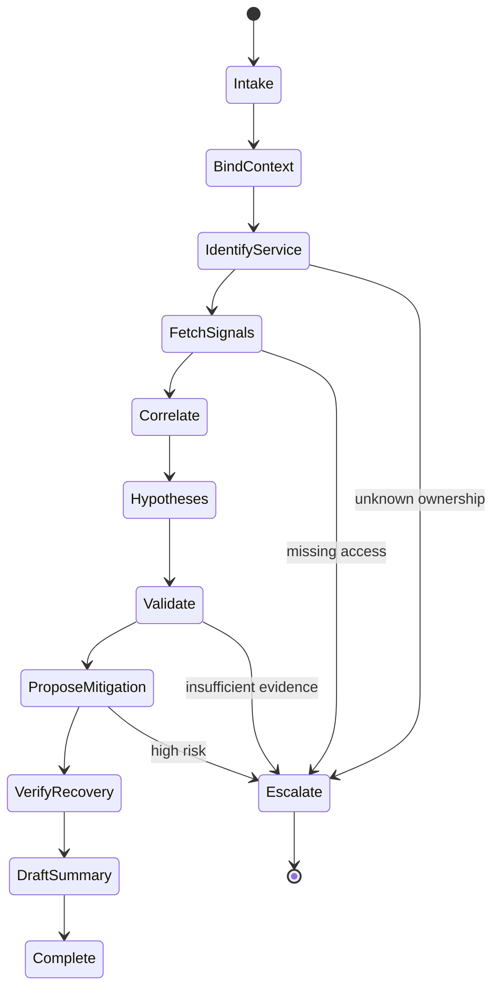
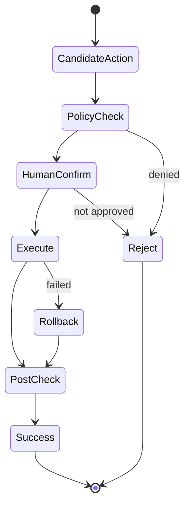
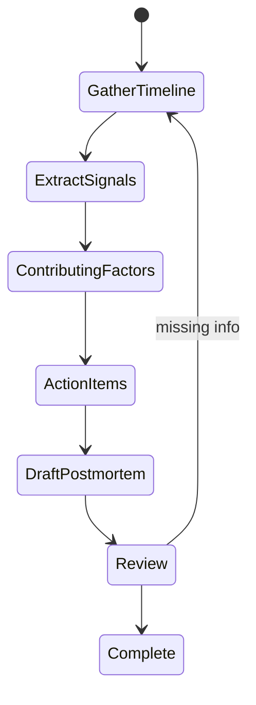
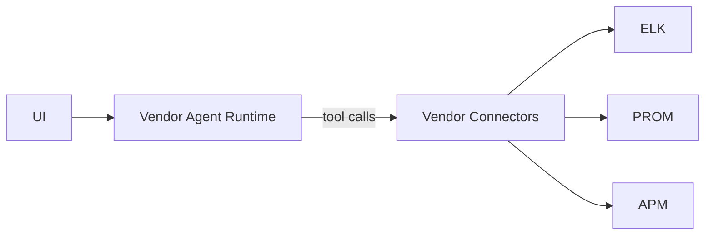
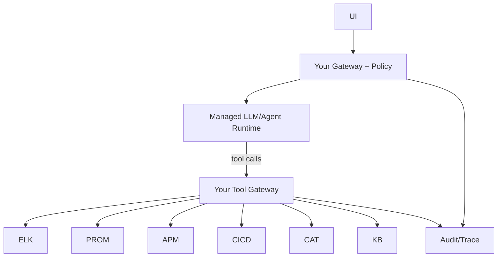
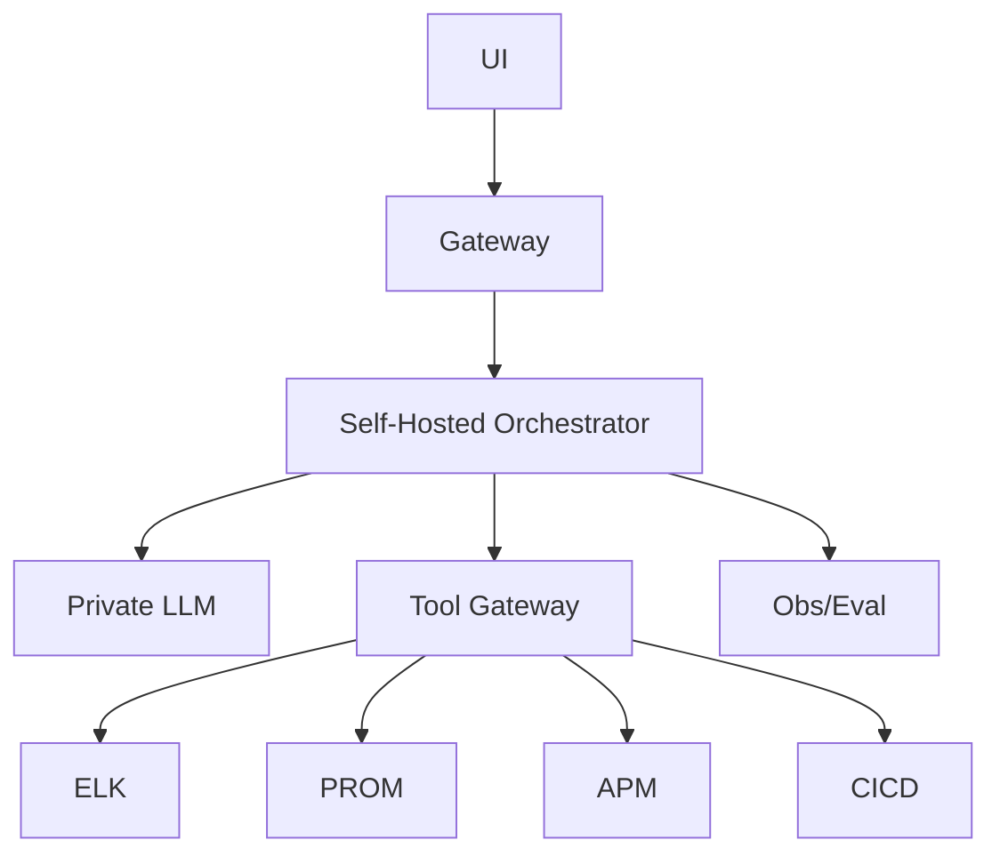

[Previous](12_05_medical_agent_architecture.md)

# Ops Troubleshooting Agent Architecture  

## Table of Contents

- [0. What this agent must actually do](#0-what-this-agent-must-actually-do)
  - [0.1 High‑value tasks](#01-highvalue-tasks)
  - [0.2 Optional tasks (only with strong controls)](#02-optional-tasks-only-with-strong-controls)
  - [0.3 Hard non‑goals (unless you want outages)](#03-hard-nongoals-unless-you-want-outages)
- [1. Data reality in ops: where truth lives](#1-data-reality-in-ops-where-truth-lives)
- [2. Storage/retrieval: what goes where](#2-storageretrieval-what-goes-where)
  - [2.1 Logs](#21-logs)
  - [2.2 Metrics](#22-metrics)
  - [2.3 Traces](#23-traces)
  - [2.4 Runbooks / SOPs](#24-runbooks-sops)
  - [2.5 Topology / service map / ownership](#25-topology-service-map-ownership)
  - [2.6 Change history](#26-change-history)
- [3. Reference architecture (common across deployment modes)](#3-reference-architecture-common-across-deployment-modes)
  - [3.1 High‑level block diagram](#31-highlevel-block-diagram)
  - [3.2 Why the orchestrator matters here](#32-why-the-orchestrator-matters-here)
- [4. Orchestrator workflows (state machines)](#4-orchestrator-workflows-state-machines)
  - [4.1 Incident triage and diagnosis](#41-incident-triage-and-diagnosis)
  - [4.2 Safe remediation (gated)](#42-safe-remediation-gated)
  - [4.3 Postmortem assistant](#43-postmortem-assistant)
- [5. Tool contracts (what the agent must call)](#5-tool-contracts-what-the-agent-must-call)
  - [5.1 Context binding (non‑negotiable)](#51-context-binding-nonnegotiable)
  - [5.2 Logs tools](#52-logs-tools)
  - [5.3 Metrics tools](#53-metrics-tools)
  - [5.4 Tracing tools](#54-tracing-tools)
  - [5.5 Events/change tools](#55-eventschange-tools)
  - [5.6 Runbook/SOP retrieval (RAG)](#56-runbooksop-retrieval-rag)
  - [5.7 Action tools (gated)](#57-action-tools-gated)
  - [5.8 Structured error contract (mandatory)](#58-structured-error-contract-mandatory)
- [6. Evidence contract (how the agent must answer)](#6-evidence-contract-how-the-agent-must-answer)
- [7. Retrieval strategy: when to use RAG vs tools](#7-retrieval-strategy-when-to-use-rag-vs-tools)
  - [7.1 What RAG is best at (ops)](#71-what-rag-is-best-at-ops)
  - [7.2 What specialized tools must handle](#72-what-specialized-tools-must-handle)
  - [7.3 Thumb rule](#73-thumb-rule)
- [8. Guardrails and safety (production ops is dangerous)](#8-guardrails-and-safety-production-ops-is-dangerous)
  - [8.1 Scope isolation](#81-scope-isolation)
  - [8.2 Action gating](#82-action-gating)
  - [8.3 Tool budgets](#83-tool-budgets)
  - [8.4 Prompt injection](#84-prompt-injection)
- [9. Three deployment options (what to choose and why)](#9-three-deployment-options-what-to-choose-and-why)
  - [9.1 Option A — Agent‑as‑a‑Service (managed)](#91-option-a-agentasaservice-managed)
  - [9.2 Option B — Hybrid (recommended)](#92-option-b-hybrid-recommended)
  - [9.3 Option C — In‑house (only when forced)](#93-option-c-inhouse-only-when-forced)
- [10. How the agent “knows where to look” (routing logic)](#10-how-the-agent-knows-where-to-look-routing-logic)
  - [10.1 Routing inputs](#101-routing-inputs)
  - [10.2 Routing outputs](#102-routing-outputs)
  - [10.3 Practical routing heuristic](#103-practical-routing-heuristic)
- [11. Example: “error on particular day/node” (how it answers)](#11-example-error-on-particular-daynode-how-it-answers)
  - [User](#user)
  - [Agent behavior](#agent-behavior)
- [12. Observability and evaluation](#12-observability-and-evaluation)
  - [12.1 What to log](#121-what-to-log)
  - [12.2 Metrics](#122-metrics)
  - [12.3 Golden incident suite](#123-golden-incident-suite)
- [13. Common failure modes (what will break)](#13-common-failure-modes-what-will-break)
- [14. Recommended approach (summary)](#14-recommended-approach-summary)
- [Appendix A — Minimal implementation checklist](#appendix-a-minimal-implementation-checklist)
- [Appendix B — Suggested MCP packaging (optional)](#appendix-b-suggested-mcp-packaging-optional)


> **Use case #6:** Support/Ops Engineering Troubleshooting Agent (SRE/DevOps assistant)
>
> **Goal:** A production architecture blueprint for an agent that can investigate incidents, correlate signals (logs/metrics/traces/events), propose fixes, and optionally execute **safe** actions.
>
> **Design stance (brutal):** Most “ops agents” fail because they:
> - treat logs as documents (they’re *time series* with structure)
> - skip identity/permissions (multi‑tenant blast radius)
> - have no deterministic verification (they hallucinate root causes)
> - try to be autonomous before being accurate
>
> A real ops agent is a **workflow engine** around **observability tools**, with a strict **evidence contract** and **action gating**.

---

## 0. What this agent must actually do

### 0.1 High‑value tasks
- **Triage**: summarize incident, scope, impact, likely owners
- **Signal correlation**: logs + metrics + traces + deploy events + config changes
- **Hypothesis generation**: top 3 plausible root causes with evidence
- **Runbook navigation**: find relevant runbooks, apply checklists
- **Debug assistance**: craft targeted queries (KQL/Lucene/LogQL/PromQL)
- **Remediation proposal**: safe steps with risk notes and rollback
- **Postmortem draft**: timeline, contributing factors, action items

### 0.2 Optional tasks (only with strong controls)
- **Execute safe actions**: restart deployment, scale, rollback, rotate pods
- **Open tickets**: JIRA/ServiceNow, create incident channel, notify oncall
- **Automated verification**: check SLOs recovered after changes

### 0.3 Hard non‑goals (unless you want outages)
- Unreviewed destructive actions in prod
- “Fix the incident” without confirming environment/tenant
- Accessing customer data outside strict scopes

---

## 1. Data reality in ops: where truth lives

Ops truth is distributed:

- **Logs**: ELK/OpenSearch, Loki, Splunk, Cloud Logging
- **Metrics**: Prometheus, Datadog, CloudWatch, New Relic
- **Traces**: Jaeger, Tempo, X-Ray, Datadog APM
- **Events/Deploys**: CI/CD, GitOps, Kubernetes events, change management
- **Inventory/CMDB**: services, owners, dependencies, runbooks
- **Config**: Git repos (IaC), feature flags, runtime config

**Blunt rule:** Don’t “RAG everything.” You primarily need **specialized tools** + **time‑bounded queries** + **dependency context**.

---

## 2. Storage/retrieval: what goes where

### 2.1 Logs
- **Store:** ELK/OpenSearch/Loki/Splunk (native)
- **Fetch:** query APIs (time range, service, cluster, request id)

**Vectorize?**
- Generally **no** for raw logs. Too high volume and low semantic density.
- **Yes** for:
  - recurring incident patterns (curated)
  - summarized incidents and postmortems
  - runbook text

### 2.2 Metrics
- **Store:** Prometheus/Datadog/CloudWatch
- **Fetch:** PromQL / vendor queries

**Vectorize?** No. Metrics are numeric/time series.

### 2.3 Traces
- **Store:** Tempo/Jaeger/APM
- **Fetch:** trace id lookup + exemplars + spans

**Vectorize?** Usually no. Keep structured.

### 2.4 Runbooks / SOPs
- **Store:** docs (Confluence, Git, wiki)
- **Fetch:** search + RAG

**Vectorize?** Yes. This is *ideal* for RAG.

### 2.5 Topology / service map / ownership
- **Store:** CMDB/service catalog (Backstage, internal DB)
- **Fetch:** deterministic queries

**Vectorize?** Not necessary; structured lookup is better.

### 2.6 Change history
- **Store:** CI/CD logs, Git, deployment events
- **Fetch:** deterministic

**Vectorize?** Optional for summaries.

---

## 3. Reference architecture (common across deployment modes)

### 3.1 High‑level block diagram

```mermaid
flowchart TB
  Oncall[Oncall Engineer] --> UI[Chat/Slack/CLI/Console]
  UI --> GW[Ops Agent Gateway]

  GW --> ORCH[Orchestrator / Incident Workflow Engine]
  ORCH --> LLM[LLM Reasoning Layer]

  ORCH -->|Query| LOGS[Logs Tools]
  ORCH -->|Query| MET[Metrics Tools]
  ORCH -->|Query| TRACE[Tracing Tools]
  ORCH -->|Query| EVT[Events/Deploy Tools]
  ORCH -->|Lookup| CAT[Service Catalog / CMDB]
  ORCH -->|Retrieve| RAG[Runbook RAG]
  ORCH -->|Execute (gated)| ACT[Action Tools]
  ORCH -->|Validate| RULES[Rules/Policies]

  LOGS --> ELK[(ELK/OpenSearch/Loki/Splunk)]
  MET --> PROM[(Prom/Datadog/CloudWatch)]
  TRACE --> APM[(Tempo/Jaeger/APM)]
  EVT --> CICD[(CI/CD + GitOps)]
  CAT --> SVC[(Service Catalog)]
  RAG --> KB[(Runbooks/SOPs/Postmortems)]
  ACT --> K8S[(K8s/Cloud APIs)]

  ORCH --> OBS[Observability + Audit]
  ACT --> OBS
  RULES --> OBS
```

### 3.2 Why the orchestrator matters here
Ops work is a **state machine** (triage → scope → isolate → mitigate → verify → learn). LLMs can help plan/query/explain, but deterministic orchestration prevents:
- wrong cluster
- wrong tenant
- wrong time range
- runaway tool calls
- unsafe remediation

---

## 4. Orchestrator workflows (state machines)

### 4.1 Incident triage and diagnosis



### 4.2 Safe remediation (gated)



### 4.3 Postmortem assistant



---

## 5. Tool contracts (what the agent must call)

### 5.1 Context binding (non‑negotiable)
Ops must bind:
- environment (dev/stage/prod)
- cluster/region
- tenant/account
- service/team ownership
- incident window

Tools:
- `context.bind(env, region, cluster, tenant, incident_id?) -> scope_token`
- `catalog.resolve_service(query) -> service_id + owners + dependencies`

### 5.2 Logs tools
- `logs.query(scope_token, query, start_ts, end_ts, limit) -> events[]`
- `logs.tail(scope_token, query, duration, limit_per_min) -> stream_ref`
- `logs.get_by_trace_id(scope_token, trace_id) -> events[]`

Support multiple backends:
- ELK/OpenSearch (Lucene/KQL)
- Loki (LogQL)
- Splunk (SPL)

### 5.3 Metrics tools
- `metrics.query(scope_token, promql_or_vendor_query, start_ts, end_ts, step) -> series[]`
- `metrics.slo(scope_token, service_id, window) -> slo_status`
- `metrics.topk(scope_token, metric, by, k, window) -> list`

### 5.4 Tracing tools
- `trace.get(scope_token, trace_id) -> trace`
- `trace.search(scope_token, filters, start_ts, end_ts, limit) -> traces[]`
- `trace.exemplars(scope_token, metric, start_ts, end_ts) -> trace_ids[]`

### 5.5 Events/change tools
- `events.deploys(scope_token, service_id, start_ts, end_ts) -> deploys[]`
- `events.k8s(scope_token, namespace, start_ts, end_ts) -> k8s_events[]`
- `git.changes(service_repo, start_ts, end_ts) -> commits[]`
- `flags.changes(scope_token, service_id, start_ts, end_ts) -> flag_events[]`

### 5.6 Runbook/SOP retrieval (RAG)
- `runbooks.search(query, service_id?, severity?, version?) -> passages[] + citations`
- `postmortems.search(query, service_id?, tags?) -> passages[] + citations`

### 5.7 Action tools (gated)
Start read‑only. Add writes later.

Read tools:
- `k8s.get_deploy_status(scope_token, namespace, deploy) -> status`
- `k8s.get_pods(scope_token, namespace, selector) -> pods[]`

Write tools (only with tiered approvals):
- `k8s.rollout_restart(scope_token, namespace, deploy) -> result`
- `k8s.scale(scope_token, namespace, deploy, replicas) -> result`
- `cicd.rollback(scope_token, service_id, to_version) -> result`

### 5.8 Structured error contract (mandatory)

```json
{
  "ok": false,
  "error": {
    "type": "AccessDenied|ScopeNotBound|InvalidQuery|BackendDown|Timeout|RateLimited|NotFound",
    "message": "...",
    "retryable": true,
    "details": {"backend": "loki", "scope": "prod-eu1"}
  }
}
```

---

## 6. Evidence contract (how the agent must answer)

Every troubleshooting response must include:

1) **Scope**: env/region/cluster/service/time window
2) **Observed facts**: metrics/log snippets/trace spans with timestamps
3) **Correlation**: “deploy at T0 preceded error spike at T0+3m”
4) **Hypotheses**: ranked with supporting/contradicting evidence
5) **Next queries**: exact queries to run (PromQL/LogQL/KQL)
6) **Mitigation options**: risk + rollback + verification step

If evidence is missing:
- explicitly say “Cannot conclude; need X” and run the tool to fetch X.

---

## 7. Retrieval strategy: when to use RAG vs tools

### 7.1 What RAG is best at (ops)
- runbooks and SOPs
- known incident patterns (“OOM kill storm after config X”)
- remediation checklists
- postmortem learnings

### 7.2 What specialized tools must handle
- logs/metrics/traces queries
- inventory/ownership
- deployments and changes

### 7.3 Thumb rule
- If it’s **time‑series or structured**, query the system of record.
- If it’s **procedural text**, use RAG.

---

## 8. Guardrails and safety (production ops is dangerous)

### 8.1 Scope isolation
- scope token required for every tool call
- explicit env selection (no implicit “prod”)
- prevent cross‑tenant queries

### 8.2 Action gating
Define tiers:

**Tier 0 (default): Read‑only**
- query, correlate, propose

**Tier 1: Guided actions**
- agent prepares a command; human runs it

**Tier 2: Approved execution**
- agent executes pre‑approved actions with confirmation

**Tier 3: Autonomous remediation (rare)**
- only for low‑risk, well‑tested runbooks + tight rollback

**Blunt rule:** most orgs should live at Tier 0–2.

### 8.3 Tool budgets
- max queries per minute
- max time window size by default (prevent huge scans)
- query templates to avoid expensive patterns

### 8.4 Prompt injection
Logs can contain adversarial strings.
Mitigation:
- never let log text directly trigger tool calls
- orchestrator validates tool call schemas and permissions

---

## 9. Three deployment options (what to choose and why)

### 9.1 Option A — Agent‑as‑a‑Service (managed)

**Best fit:**
- lightweight triage assistant
- public/cloud‑native logs where policy allows



**Pros**
- fast adoption
- minimal infra

**Cons**
- sensitive log exposure
- uneven connector quality
- limited control over scoping/audit

Use only if you can tolerate vendor boundary.

---

### 9.2 Option B — Hybrid (recommended)

Managed reasoning + **your** tool gateways enforce scoping and audit.



**Pros**
- logs/metrics stay in your boundary
- strongest security posture without full self‑hosting
- portability across models

**Cons**
- you run tool gateway + observability + maybe RAG

---

### 9.3 Option C — In‑house (only when forced)

**Best fit:**
- regulated environments
- air‑gapped networks
- extremely sensitive telemetry



**Pros**
- maximum control

**Cons**
- expensive to maintain
- quality/evals are your job

---

## 10. How the agent “knows where to look” (routing logic)

The agent should not guess. Use a deterministic router:

### 10.1 Routing inputs
- user question intent (error, latency, outage, deploy issue)
- entity extraction (service, cluster, namespace, node)
- time window extraction
- severity (P0/P1)

### 10.2 Routing outputs
- which backends to query (logs/metrics/traces/events)
- which query templates to start with
- which runbooks to retrieve

### 10.3 Practical routing heuristic
- **Latency/availability** → metrics + traces first
- **Errors/exceptions** → logs + traces, then metrics
- **After deploy** → deploy events + logs around deploy
- **Resource issues** → metrics (CPU/mem) + k8s events

---

## 11. Example: “error on particular day/node” (how it answers)

### User
“Why did node ip‑10‑2‑3‑4 throw errors on Dec 11 around 02:10?”

### Agent behavior
1) Bind scope (env/cluster)
2) Query logs with node filter + time window
3) Pull k8s events for that node
4) Query metrics (node memory pressure, disk)
5) Correlate timeline
6) Propose top hypotheses + next queries
7) Provide mitigation with rollback

**Output must include:** timestamps, query strings, and “cannot conclude without X” if missing.

---

## 12. Observability and evaluation

### 12.1 What to log
- scope token + incident id
- queries executed (templates + filters)
- tool call latency/cost
- hypotheses produced
- actions proposed/executed

### 12.2 Metrics
- time‑to‑first‑useful‑hypothesis
- % incidents resolved faster
- escalation rate to humans
- false‑cause rate (from postmortems)
- query cost (backend load)

### 12.3 Golden incident suite
Create replayable scenarios:
- deploy regression
- DB connection pool exhaustion
- OOM kill
- DNS failure
- certificate expiry

Agent must:
- find right signals
- avoid unsafe actions
- produce correct hypotheses

---

## 13. Common failure modes (what will break)

- wrong scope (prod vs stage)
- too wide time window → noise
- treating one log line as root cause
- ignoring deploy/change timeline
- recommending restarts as first response
- query storming observability backend

Mitigation: scope binding, query budgets, evidence contract, and change correlation.

---

## 14. Recommended approach (summary)

For most organizations:

- Choose **Hybrid**
- Start at **Tier 0 read‑only**
- Build deterministic **tool gateways** for logs/metrics/traces/events
- Use RAG for runbooks and postmortems, not telemetry truth
- Enforce evidence contract and action gating

---

## Appendix A — Minimal implementation checklist

- [ ] Scope binding + service catalog lookup
- [ ] Logs/metrics/traces/event tool connectors
- [ ] Query templates and budgets
- [ ] Runbook RAG with citations
- [ ] Action tools (read‑only first)
- [ ] Audit logging with redaction
- [ ] Golden incident evaluation suite

---

## Appendix B — Suggested MCP packaging (optional)

If using MCP, expose 6 servers:
- `ops-context` (bind scope/service ownership)
- `ops-logs` (ELK/Loki/Splunk)
- `ops-metrics` (Prom/Datadog/CloudWatch)
- `ops-tracing` (Tempo/Jaeger/APM)
- `ops-events` (deploys/k8s/git/flags)
- `ops-actions` (gated remediation)

Keep `ops-actions` disabled by default; enable per environment with explicit approvals.

[Previous](12_05_medical_agent_architecture.md)
